# Contributing to pysystemtrade Documentation

Thank you for your interest in contributing to the pysystemtrade documentation! This guide will help you understand how to contribute effectively.

```mermaid
graph LR
    subgraph "Contribution Process"
        Issue[📝 Create Issue<br/>or Discussion]
        Fork[🔀 Fork Repository]
        Branch[🌿 Create Branch]
        Changes[✏️ Make Changes]
        Test[🧪 Test Changes]
        PR[📥 Pull Request]
        Review[👥 Code Review]
        Merge[🔄 Merge]
    end
    
    Issue --> Fork
    Fork --> Branch
    Branch --> Changes
    Changes --> Test
    Test --> PR
    PR --> Review
    Review --> Merge
    
    classDef process fill:#e8f5e8
    class Issue,Fork,Branch,Changes,Test,PR,Review,Merge process
```



## Ways to Contribute

### **📝 Documentation Improvements**
- Fix typos, grammar, or formatting issues
- Improve clarity and readability
- Add missing information or examples
- Update outdated content

### **🎨 Visual Enhancements**
- Create or improve mermaid diagrams
- Add helpful screenshots or illustrations
- Improve documentation structure and navigation
- Enhance visual consistency

### **💡 New Content**
- Write new tutorials or guides
- Add real-world examples
- Create troubleshooting guides
- Develop reference materials

### **🔧 Technical Contributions**
- Improve documentation generation scripts
- Enhance documentation infrastructure
- Fix broken links or references
- Optimize documentation performance

## Getting Started

### **1. Fork Structure Awareness**
This is a fork of the main pysystemtrade repository. All documentation contributions should be made to the `fork_extensions/docs/` directory to avoid conflicts during upstream merges.

```
fork_extensions/docs/
├── README.md                    # Main documentation index
├── project-overview.md          # Project introduction
├── installation.md              # Installation instructions
├── CHANGELOG.md                 # Documentation changes
├── CONTRIBUTING.md              # This file
├── architecture/                # Architecture documentation
├── guides/                      # User guides  
├── examples/                    # Examples and tutorials
├── tutorials/                   # Step-by-step tutorials
├── production/                  # Production documentation
├── reference/                   # Reference materials
└── lld/                        # Low-level design specs
```

### **2. Development Environment**
```bash
# Clone your fork
git clone https://github.com/yourusername/pysystemtrade.git
cd pysystemtrade

# Add upstream remote
git remote add upstream https://github.com/robcarver17/pysystemtrade.git

# Create documentation branch
git checkout -b docs/your-improvement-name

# Make your changes to fork_extensions/docs/
```

### **3. Documentation Standards**
Follow our documentation standards for consistency:

#### **Writing Style**
- Use clear, concise language
- Write for your target audience (beginner, intermediate, advanced)
- Include practical examples wherever possible
- Use active voice and present tense
- Break up long paragraphs with headers and lists

#### **Formatting Standards**
- Use ATX-style headers (`# Header` not `Header\n======`)
- Include table of contents for long documents
- Use code fences with language specification
- Follow consistent heading capitalization
- Use bullet points for lists, numbered lists for sequences

#### **Mermaid Diagram Standards**

```mermaid
graph TB
    subgraph "Standard Elements"
        Node1[📊 Descriptive Text<br/>with Icon]
        Node2[🔧 Clear Labels<br/>and Purpose]
    end
    
    Node1 --> Node2
    
    classDef standard fill:#e8f5e8
    class Node1,Node2 standard
```


**Mermaid Guidelines:**
- Include descriptive icons (emoji) in node labels
- Use consistent color schemes with `classDef`
- Group related nodes in `subgraph` containers
- Keep diagrams focused and not overly complex
- Ensure diagrams are readable on both light and dark themes

## Documentation Categories & Guidelines

### **Architecture Documentation (`architecture/`)**
**Purpose:** Strategic and high-level system design documentation
- Focus on "why" decisions were made, not just "what" was implemented
- Include comprehensive diagrams showing relationships
- Target audience: architects, senior developers, decision-makers
- Maintain separation between HLD (strategic) and system overview (tactical)

### **User Guides (`guides/`)**
**Purpose:** Practical, task-oriented documentation for users
- Provide step-by-step instructions
- Include prerequisites and expected outcomes
- Test all procedures on a fresh environment
- Target audience: developers, traders, system administrators

### **Examples & Tutorials (`examples/`, `tutorials/`)**
**Purpose:** Hands-on learning materials with executable code
- Provide complete, runnable examples
- Include sample data and expected outputs
- Follow progressive difficulty (beginner → expert)
- Test all code examples regularly

### **Production Documentation (`production/`)**
**Purpose:** Enterprise deployment and operations guidance
- Focus on reliability, security, and scalability
- Include checklists and procedures
- Cover monitoring, alerting, and troubleshooting
- Target audience: DevOps, production engineers

### **Reference Documentation (`reference/`)**
**Purpose:** Quick lookup and comprehensive specifications
- Maintain accurate API documentation
- Include configuration parameter references
- Provide quick reference cards
- Keep synchronized with code changes

### **Low-Level Design (`lld/`)**
**Purpose:** Detailed technical implementation specifications
- Include class diagrams and code examples
- Document algorithms and data structures
- Explain implementation decisions
- Target audience: developers, maintainers

## Contribution Process

### **1. Before You Start**
- Check existing issues and discussions
- Review similar documentation to maintain consistency
- Understand the target audience for your contribution
- Consider the long-term maintainability of your changes

### **2. Making Changes**
- Follow the established folder structure
- Use consistent formatting and style
- Test any code examples you include
- Verify all links work correctly
- Validate mermaid diagrams render properly

### **3. Testing Your Changes**
```bash
# Check markdown formatting
markdownlint fork_extensions/docs/**/*.md

# Verify mermaid diagrams
mermaid -i input.md -o output.html

# Test local documentation serving (if available)
python -m http.server 8000 -d fork_extensions/docs/
```

### **4. Submitting Changes**
```bash
# Commit your changes
git add fork_extensions/docs/
git commit -m "docs: improve trading strategy examples with real-world scenarios"

# Push to your fork
git push origin docs/your-improvement-name

# Create pull request through GitHub interface
```

### **5. Pull Request Guidelines**
**PR Title Format:**
- `docs: <brief description of change>`
- Examples: "docs: add production deployment checklist"
- Examples: "docs: fix broken links in API reference"

**PR Description Template:**
```markdown
## Description
Brief description of the changes made.

## Type of Change
- [ ] Documentation fix (typo, grammar, formatting)
- [ ] Content improvement (clarity, examples, completeness)
- [ ] New documentation (new guide, tutorial, reference)
- [ ] Visual enhancement (diagrams, structure, navigation)
- [ ] Infrastructure improvement (scripts, automation)

## Changes Made
- Specific change 1
- Specific change 2
- Specific change 3

## Testing
- [ ] All links verified
- [ ] Code examples tested
- [ ] Mermaid diagrams validated
- [ ] Formatting checked

## Target Audience
Specify who this documentation is intended for (beginners, advanced users, etc.)
```

### **6. Review Process**
- Documentation maintainers will review your PR
- Address any feedback or requested changes
- Maintain patience - quality documentation takes time to review
- Be responsive to reviewer comments and suggestions

## Style Guidelines

### **Voice and Tone**
- **Instructional:** Clear, direct instructions for procedures
- **Explanatory:** Helpful context for complex concepts  
- **Professional:** Appropriate for enterprise environments
- **Accessible:** Understandable by target skill level

### **Code Examples**
```python
# Good: Complete, runnable example with context
from systems.provided.example.simplesystem import simplesystem

# Create a simple trading system
system = simplesystem()

# Get forecasts for a specific instrument
forecasts = system.rules.get_raw_forecast("SOFR", "ewmac")
print(f"Generated {len(forecasts)} forecasts")
```

### **Configuration Examples**
```yaml
# Good: Well-commented configuration with explanations
# Volatility targeting configuration
percentage_vol_target: 25        # Target 25% annualized volatility
notional_trading_capital: 1000000  # $1M trading capital

# Risk management settings
forecast_cap: 20.0              # Maximum forecast level
use_forecast_scale_estimates: True  # Use dynamic scaling
```

## Recognition

Contributors will be recognized in:
- Documentation changelog entries
- Commit co-authorship where appropriate
- Special thanks sections for significant contributions

## Questions and Help

- **General Questions:** Create a GitHub Discussion
- **Bug Reports:** Create a GitHub Issue
- **Feature Requests:** Create a GitHub Issue with "enhancement" label
- **Direct Communication:** Contact maintainers through GitHub

## Code of Conduct

Please be respectful, constructive, and collaborative. We welcome contributors from all backgrounds and experience levels. Focus on improving the documentation for all users.

---

*Thank you for helping make pysystemtrade documentation better for everyone!*