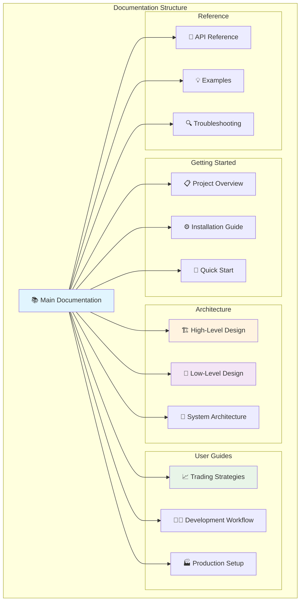
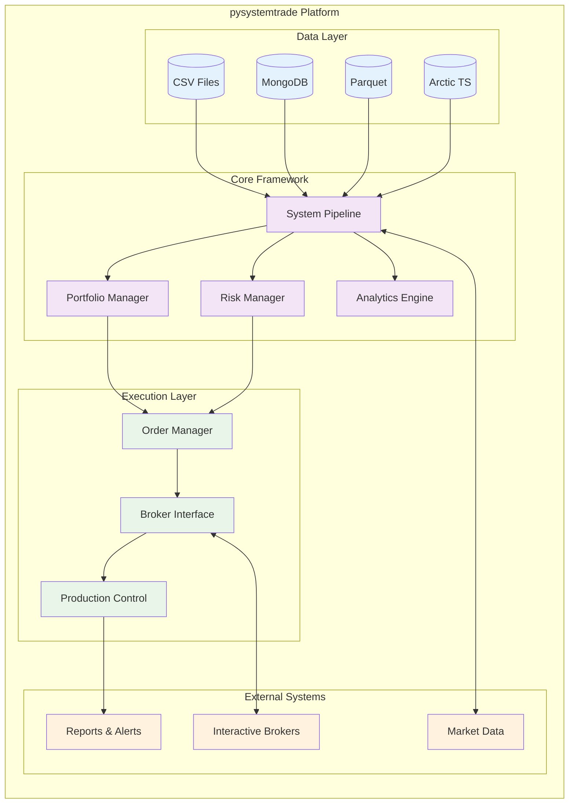
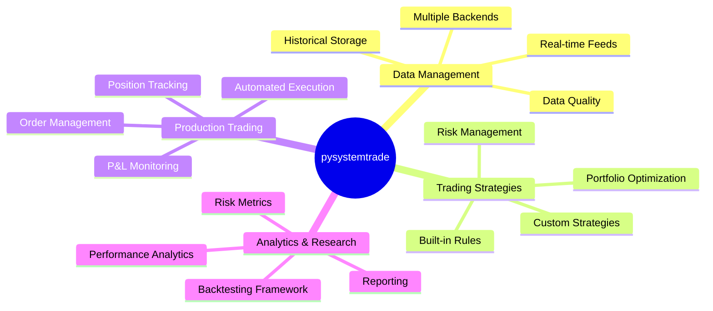

# pysystemtrade Documentation

Comprehensive documentation for the pysystemtrade systematic futures trading framework.

## Documentation Organization

### **🎯 Getting Started**
- **[Project Overview](project-overview.md)** - What pysystemtrade is and what it does
- **[Installation Guide](installation.md)** - Complete setup for development and production
- **[Quick Start](guides/quick-start.md)** - Build your first trading system in 10 minutes

### **🏗️ Architecture Documentation**
Complete architectural specifications from strategic to implementation level:
- **[Architecture Overview](architecture/README.md)** - Comprehensive architectural documentation
- **[System Overview](architecture/system-overview.md)** - Core concepts and design principles
- **[High-Level Design (HLD)](architecture/hld/README.md)** - Strategic architecture and system design
- **[Low-Level Design (LLD)](lld/README.md)** - Detailed technical specifications

### **📚 User Guides**
Practical guides for development and production:
- **[User Guides Overview](guides/README.md)** - Complete guide navigation
- **[Trading Strategies](guides/trading-strategies.md)** - Built-in and custom trading rules
- **[Development Workflow](guides/development-workflow.md)** - Best practices and testing
- **[Production Setup](guides/production-setup.md)** - Going live with real trading

### **📖 Reference Materials**
- **[API Reference](api-reference.md)** - Key classes, methods, and interfaces
- **[Examples & Tutorials](examples/README.md)** - Real-world usage examples
- **[Troubleshooting Guide](troubleshooting.md)** - Common issues and solutions

## System Overview

## Key Features & Capabilities

## Documentation Principles

This documentation follows enterprise-grade standards:

- **📋 Comprehensive Coverage** - Complete system understanding from concepts to implementation
- **🎯 Practical Focus** - Real-world examples and production-ready patterns
- **🏗️ Architectural Clarity** - Clear separation between strategic and tactical documentation
- **📖 Easy Navigation** - Logical organization with cross-references and visual guides
- **🔄 Living Documentation** - Regularly updated to reflect system evolution
- **🎨 Visual Design** - Mermaid diagrams and structured presentations

## About This Documentation

This documentation is generated from comprehensive analysis of the pysystemtrade codebase and provides enterprise-grade architectural and implementation guidance. It complements the official documentation by focusing on practical usage, architectural patterns, and production deployment strategies.

- **Target Audience**: Developers, quants, system architects, and trading professionals
- **Scope**: Complete systematic trading platform implementation
- **Focus**: Production-ready patterns and enterprise architecture
- **Last Updated**: 2025-01-08
- **pysystemtrade Version**: 1.8.2+

---

**🚀 [Start with Project Overview](project-overview.md) | 🏗️ [Architecture Documentation](architecture/README.md) | 📚 [User Guides](guides/README.md)**