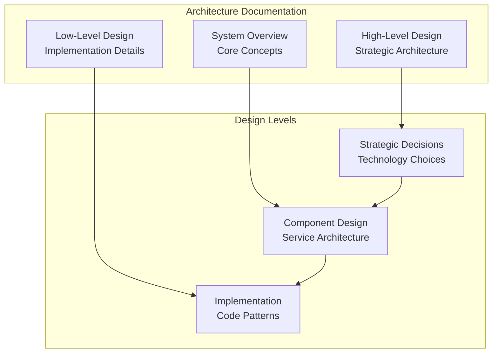
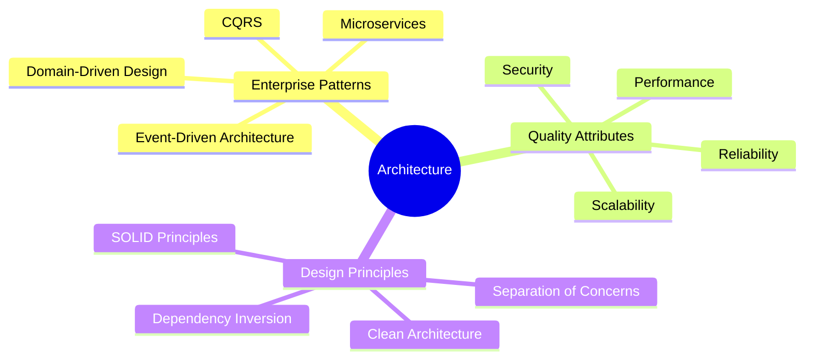
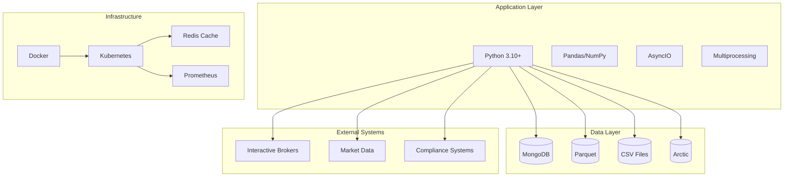

# Architecture Documentation

Comprehensive architectural documentation for pysystemtrade's enterprise systematic trading platform.

## System Architecture Overview

pysystemtrade follows a **modular, stage-based architecture** that separates concerns and allows for flexible configuration and extension. The system is built around the concept of **data pipelines** and **processing stages** that transform raw market data into trading decisions.

### **Core Design Principles**

1. **Stage-Based Processing** - Data flows through well-defined stages: Raw Data → Forecasting → Position Sizing → Portfolio → Execution → Accounting
2. **Data Abstraction** - Clean separation between data sources and business logic through abstract base classes and interfaces
3. **Configuration-Driven** - System behavior controlled through YAML configuration files, not hard-coded parameters
4. **Modular Design** - Independent, testable components that can be combined in different ways

## Architecture Documentation Structure

### **[High-Level Design (HLD)](hld/README.md)**
Strategic architectural documentation covering:
- **[System Architecture Overview](hld/01-system-architecture-overview.md)** - Business context and architectural drivers
- **[Data Architecture Design](hld/02-data-architecture-design.md)** - Multi-backend data strategy
- **[Business Logic Architecture](hld/03-business-logic-architecture.md)** - Domain-driven design patterns
- **[Integration Architecture](hld/04-integration-architecture.md)** - External system integration
- **[Deployment Architecture](hld/05-deployment-architecture.md)** - Infrastructure and orchestration
- **[Security Architecture](hld/06-security-architecture.md)** - Security framework and compliance
- **[Monitoring & Observability](hld/07-monitoring-observability.md)** - System monitoring and insights
- **[Scalability & Performance](hld/08-scalability-performance.md)** - Scaling strategies and optimization

### **[Low-Level Design (LLD)](lld/README.md)** 
Detailed technical specifications covering:
- **[System Framework](lld/01-system-framework.md)** - Core system implementation
- **[Data Layer](lld/02-data-layer.md)** - Data persistence and access patterns  
- **[Trading Engine](lld/03-trading-engine.md)** - Order management and execution
- **[Quantitative Framework](lld/04-quantitative-framework.md)** - Analytics and optimization
- **[Production Control](lld/05-production-control.md)** - Production processes
- **[Broker Integration](lld/06-broker-integration.md)** - External broker connectivity
- **[Risk Management](lld/07-risk-management.md)** - Risk calculations and limits
- **[Performance Optimization](lld/08-performance-optimization.md)** - System optimization

## Architectural Principles

### **Core Architectural Drivers**

1. **Low Latency** - Sub-millisecond execution requirements
2. **High Availability** - 99.99% uptime for trading operations
3. **Scalability** - Handle growing data volumes and complexity
4. **Regulatory Compliance** - Meet financial industry standards
5. **Risk Management** - Comprehensive position and market risk controls
6. **Data Integrity** - Accurate and consistent financial data
7. **Observability** - Complete system monitoring and alerting
8. **Security** - Multi-layered defense for financial operations

### **Technology Stack Overview**

## Navigation

- **[← Back to Main Documentation](../README.md)**
- **[Project Overview →](../project-overview.md)**
- **[High-Level Design →](hld/README.md)**
- **[Low-Level Design →](lld/README.md)**

---

*This architecture documentation provides comprehensive coverage from high-level strategic decisions to low-level implementation details, ensuring complete understanding of the pysystemtrade platform.*