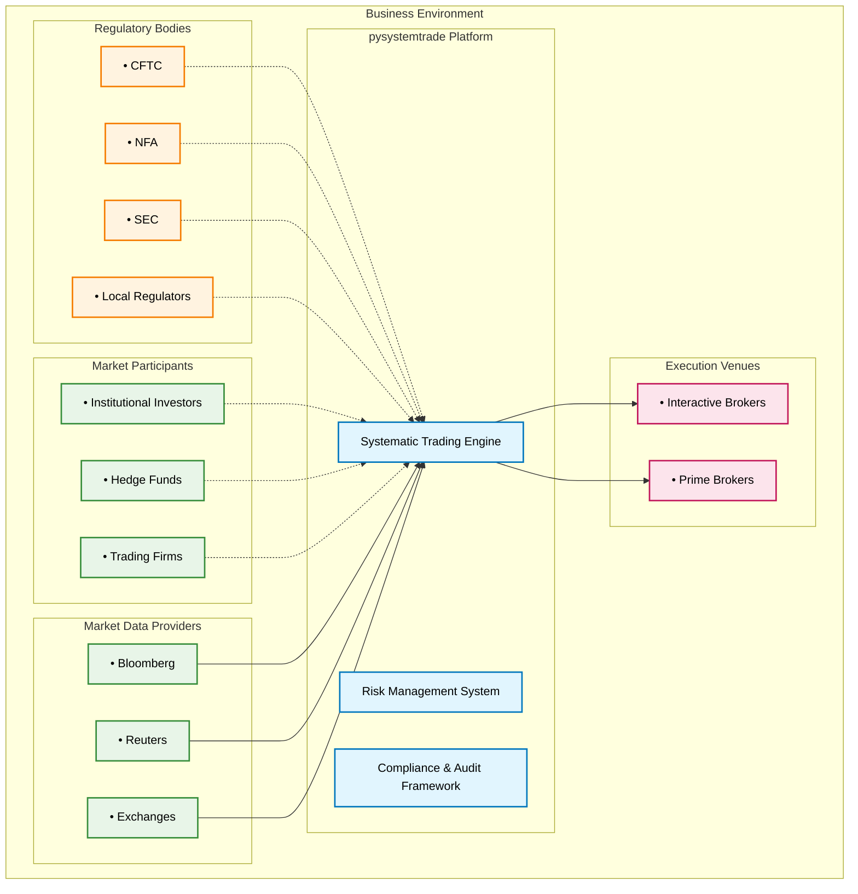
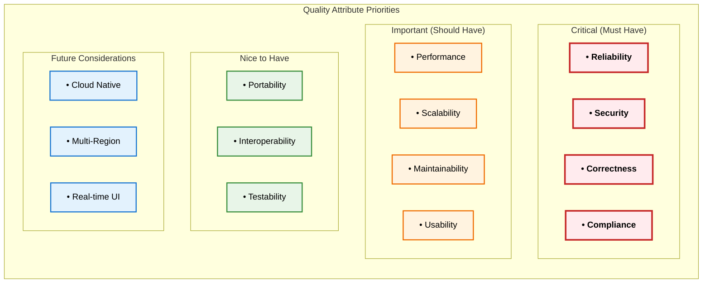
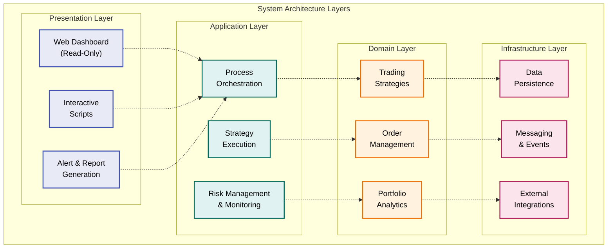
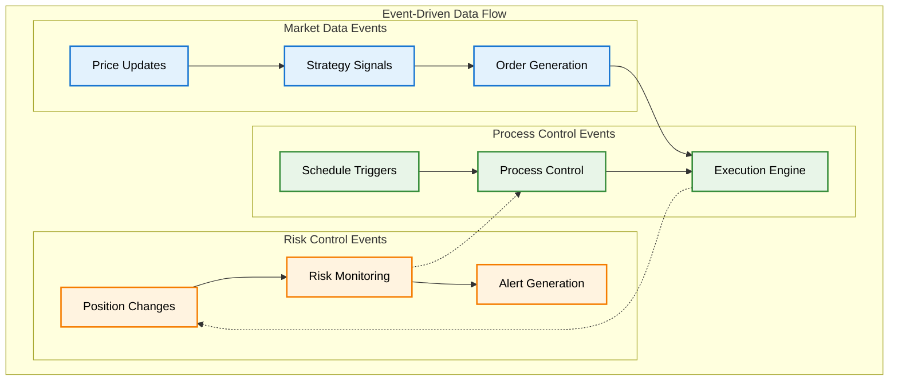
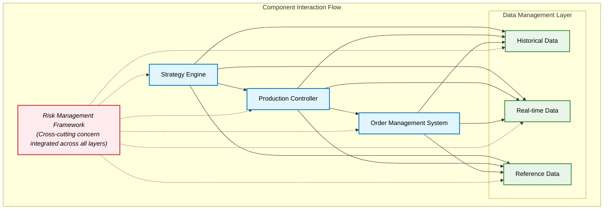

# System Architecture Overview

Enterprise architectural vision and strategic design principles for pysystemtrade's systematic trading framework.

## Executive Summary

pysystemtrade represents a sophisticated enterprise-grade systematic futures trading platform designed for institutional-quality operations. The architecture embodies principles of reliability, scalability, and maintainability while supporting complex quantitative trading strategies with real capital at risk.

### **System Vision**
*"A resilient, scalable, and secure systematic trading platform capable of managing substantial capital across global futures markets with institutional-grade reliability and risk controls."*

### **Architectural Mission**
- **Enable systematic trading at scale** - Support hundreds of instruments and multiple strategies
- **Ensure operational reliability** - 99.9%+ uptime with automated recovery capabilities
- **Provide comprehensive risk management** - Multi-layer risk controls and monitoring
- **Support rapid innovation** - Flexible architecture enabling quick strategy development
- **Maintain regulatory compliance** - Complete audit trails and compliance features

## System Context & Boundaries

### **Business Context**

### **System Boundaries**

#### **In Scope**
- **Strategy Development & Backtesting** - Complete quantitative research framework
- **Production Trading Execution** - Real-time order generation and execution
- **Risk Management** - Portfolio risk controls and position monitoring  
- **Data Management** - Historical and real-time market data processing
- **Process Orchestration** - Automated process management and scheduling
- **Monitoring & Alerting** - System health and trading performance monitoring
- **Compliance & Audit** - Complete audit trail and regulatory reporting

#### **Out of Scope**
- **Portfolio Management UI** - Web-based portfolio management interface
- **Client Reporting Portal** - External client reporting and communication
- **Regulatory Filing Automation** - Automated regulatory report generation
- **Alternative Asset Classes** - Equity, FX, or cryptocurrency trading
- **High-Frequency Trading** - Sub-millisecond latency trading strategies

### **Stakeholder Analysis**

| Stakeholder Group | Primary Concerns | Architecture Impact |
|------------------|------------------|-------------------|
| **Trading Teams** | Strategy performance, risk controls, execution quality | Business logic design, risk management architecture |
| **Operations Teams** | System reliability, monitoring, incident response | Deployment architecture, observability design |
| **Compliance Teams** | Audit trails, regulatory reporting, risk controls | Security architecture, data retention policies |
| **Technology Teams** | System maintainability, scalability, technical debt | Code architecture, development workflows |
| **Senior Management** | Business continuity, cost optimization, growth capability | Infrastructure architecture, disaster recovery |

## Architectural Drivers

### **Business Drivers**

#### **1. Capital Protection**
- **Risk Control Priority** - Protecting capital takes precedence over profit optimization
- **Position Limits** - Strict position sizing and exposure controls
- **Automated Shutdowns** - Emergency stop mechanisms for adverse conditions
- **Diversification Requirements** - Risk spreading across instruments and strategies

#### **2. Regulatory Compliance** 
- **Audit Trail Requirements** - Complete transaction and decision logging
- **Data Retention Policies** - Long-term storage of trading records
- **Risk Reporting** - Real-time risk metrics and regulatory reporting
- **Change Control** - Documented approval processes for trading changes

#### **3. Operational Efficiency**
- **24/7 Operations** - Continuous trading across global time zones
- **Automated Processes** - Minimal manual intervention requirements
- **Scalable Operations** - Support for portfolio growth without linear cost increases
- **Cost Optimization** - Efficient resource utilization and infrastructure costs

### **Technical Drivers**

#### **1. Performance Requirements**
- **Low Latency** - Order processing within 100ms end-to-end
- **High Throughput** - Support for thousands of instruments and strategies
- **Real-time Processing** - Sub-second response to market events
- **Concurrent Operations** - Parallel processing of multiple strategies

#### **2. Reliability Requirements**
- **High Availability** - 99.9%+ uptime with minimal planned downtime
- **Fault Tolerance** - Graceful degradation under component failures
- **Data Consistency** - ACID compliance for critical financial data
- **Automated Recovery** - Self-healing capabilities without manual intervention

#### **3. Security Requirements**
- **Data Protection** - Encryption of sensitive trading data
- **Access Control** - Role-based access with principle of least privilege
- **Network Security** - Secure communications with external systems
- **Threat Detection** - Monitoring for suspicious activities and intrusions

### **Quality Attributes Prioritization**

## High-Level Architecture Vision

### **Architectural Style: Layered + Event-Driven**

The system employs a **hybrid architectural pattern** combining:
- **Layered Architecture** for clear separation of concerns
- **Event-Driven Architecture** for real-time processing
- **Microservices Principles** for component independence
- **Domain-Driven Design** for business logic organization

### **System Architecture Layers**

### **Event-Driven Processing Model**

## Component Architecture

### **Core System Components**

#### **1. Strategy Engine (systems/)**
**Purpose:** Quantitative research and backtesting framework
**Key Responsibilities:**
- Multi-asset portfolio optimization
- Trading rule development and combination
- Historical backtesting with realistic cost modeling
- Performance attribution and risk analytics

**Architectural Pattern:** Pipeline + Strategy Pattern
**Quality Attributes:** Accuracy, Extensibility, Testability

#### **2. Production Controller (sysproduction/)**
**Purpose:** Live trading orchestration and process management
**Key Responsibilities:**
- Process scheduling and dependency management
- Strategy execution and capital allocation
- System monitoring and health checks
- Automated reporting and alerting

**Architectural Pattern:** Finite State Machine + Observer Pattern  
**Quality Attributes:** Reliability, Observability, Controllability

#### **3. Order Management System (sysexecution/)**
**Purpose:** Multi-tier order processing and execution
**Key Responsibilities:**
- Three-tier order stack management
- Execution algorithm selection and routing
- Fill processing and slippage analysis
- Position reconciliation and P&L tracking

**Architectural Pattern:** Chain of Responsibility + Command Pattern
**Quality Attributes:** Consistency, Traceability, Performance

#### **4. Data Management Layer (sysdata/)**
**Purpose:** Multi-backend data abstraction and persistence
**Key Responsibilities:**
- Unified data access across multiple backends
- Real-time and historical data management
- Data quality validation and cleaning
- Performance optimization and caching

**Architectural Pattern:** Repository + Adapter Pattern
**Quality Attributes:** Performance, Consistency, Flexibility

#### **5. Risk Management Framework (integrated)**
**Purpose:** Multi-layered risk controls and monitoring
**Key Responsibilities:**
- Real-time position and exposure monitoring
- Pre-trade and post-trade risk checks
- Automated risk limit enforcement
- Risk reporting and stress testing

**Architectural Pattern:** Decorator + Chain of Responsibility
**Quality Attributes:** Safety, Responsiveness, Auditability

### **Component Interaction Model**

## Technology Architecture Decisions

### **Core Technology Stack**

#### **Runtime Platform: Python 3.10+ on Linux**
**Decision:** Python as primary development language
**Rationale:** 
- Rich quantitative libraries (NumPy, Pandas, SciPy, scikit-learn)
- Strong community support for financial applications
- Rapid development and prototyping capabilities
- Excellent integration with data science tools

**Trade-offs:**
- ✅ **Pros:** Developer productivity, library ecosystem, maintainability
- ❌ **Cons:** Performance limitations, GIL constraints
- 🔧 **Mitigations:** Vectorized operations, process-based parallelism

#### **Data Architecture: Multi-Backend Strategy**
**Decision:** Hybrid data architecture with specialized backends
**Components:**
- **MongoDB** - Operational data (orders, positions, process state)
- **Parquet** - Time series data (prices, analytics results)  
- **PostgreSQL** - Reporting and analytics (future consideration)
- **Redis** - Distributed caching and session management

**Rationale:**
- Optimal performance characteristics for each data type
- Flexibility to evolve storage strategy over time
- Risk mitigation through data redundancy

#### **Integration Architecture: API-First Design**
**Decision:** RESTful APIs with message queuing for async processing
**Components:**
- **REST APIs** - Synchronous request-response operations
- **Redis/RabbitMQ** - Asynchronous message processing
- **WebSockets** - Real-time data streaming (future)

### **Architectural Decision Records (ADRs)**

#### **ADR-001: Multi-Backend Data Architecture**
**Status:** Accepted
**Context:** Need to optimize for different data access patterns
**Decision:** Use specialized databases for different data types
**Consequences:** 
- ✅ Improved performance for specific use cases
- ❌ Increased complexity in data management
- 🔧 Abstraction layer provides unified interface

#### **ADR-002: Process-Based Parallelism**
**Status:** Accepted  
**Context:** Python GIL limitations for CPU-intensive operations
**Decision:** Use separate processes for parallel execution
**Consequences:**
- ✅ True parallelism for quantitative calculations
- ❌ Higher memory overhead and IPC complexity
- 🔧 Careful process lifecycle management required

#### **ADR-003: Event-Driven Architecture for Real-time Processing**
**Status:** Accepted
**Context:** Need responsive real-time trading capabilities
**Decision:** Implement event-driven processing for time-sensitive operations
**Consequences:**
- ✅ Low latency response to market events
- ❌ Increased system complexity and debugging challenges
- 🔧 Comprehensive monitoring and observability required

## Risk & Constraint Analysis

### **Technical Risks**

| Risk | Impact | Probability | Mitigation Strategy |
|------|---------|-------------|-------------------|
| **Data Corruption** | High | Low | Multiple backup strategies, data validation |
| **System Downtime** | High | Medium | High availability deployment, automated failover |
| **Performance Degradation** | Medium | Medium | Performance monitoring, capacity planning |
| **Security Breach** | High | Low | Multi-layer security, regular security audits |
| **Integration Failures** | Medium | Medium | Circuit breakers, fallback mechanisms |

### **Business Constraints**

#### **Regulatory Constraints**
- **Record Keeping:** All trading decisions must be auditable
- **Risk Controls:** Mandatory position limits and risk monitoring
- **Reporting:** Regular regulatory reporting requirements
- **Change Control:** Documented approval for trading algorithm changes

#### **Operational Constraints**
- **Trading Hours:** System must operate during global trading hours
- **Latency:** Order processing must complete within acceptable timeframes
- **Capital:** System must protect and efficiently utilize trading capital
- **Staffing:** Minimal operational staff available for monitoring

#### **Technical Constraints**
- **Legacy Integration:** Must integrate with existing broker systems
- **Data Availability:** Dependent on external data providers
- **Infrastructure:** Limited to single data center initially
- **Budget:** Cost optimization requirements for infrastructure

### **Architecture Trade-offs**

#### **Performance vs. Maintainability**
- **Decision:** Favor maintainability with performance optimization where critical
- **Rationale:** Long-term system evolution more important than marginal performance gains
- **Implementation:** Profile-driven optimization, avoid premature optimization

#### **Flexibility vs. Simplicity**
- **Decision:** Provide flexibility through configuration rather than code changes
- **Rationale:** Strategy changes are frequent, system changes are rare
- **Implementation:** Extensive configuration framework, plugin architecture

#### **Consistency vs. Availability**
- **Decision:** Favor consistency for financial data, availability for monitoring
- **Rationale:** Financial accuracy more critical than system availability
- **Implementation:** ACID transactions for trades, eventual consistency for metrics

## Future Architecture Evolution

### **Short-term (6-12 months)**
- **Enhanced Monitoring** - Comprehensive observability platform
- **Performance Optimization** - Query optimization and caching improvements
- **Security Hardening** - Advanced threat detection and response
- **Process Automation** - Expanded automated operations capabilities

### **Medium-term (1-2 years)**  
- **Multi-Region Deployment** - Geographic distribution for disaster recovery
- **Real-time Web Interface** - Live trading dashboard and controls
- **Advanced Analytics** - Machine learning integration for strategy enhancement
- **Cloud Integration** - Hybrid cloud deployment for scalability

### **Long-term (2-5 years)**
- **Microservices Architecture** - Full decomposition into independent services
- **Event Sourcing** - Complete audit trail through event sourcing pattern
- **Multi-Asset Support** - Extension beyond futures to other asset classes
- **API Ecosystem** - Third-party integration platform

### **Evolution Principles**
- **Backward Compatibility** - Maintain existing functionality during transitions
- **Gradual Migration** - Incremental evolution rather than big-bang changes
- **Risk Management** - Careful testing and validation of architectural changes
- **Business Continuity** - No interruption to trading operations during evolution

---

**Next:** [Data Architecture Design](02-data-architecture-design.md) - Detailed data management strategy and implementation