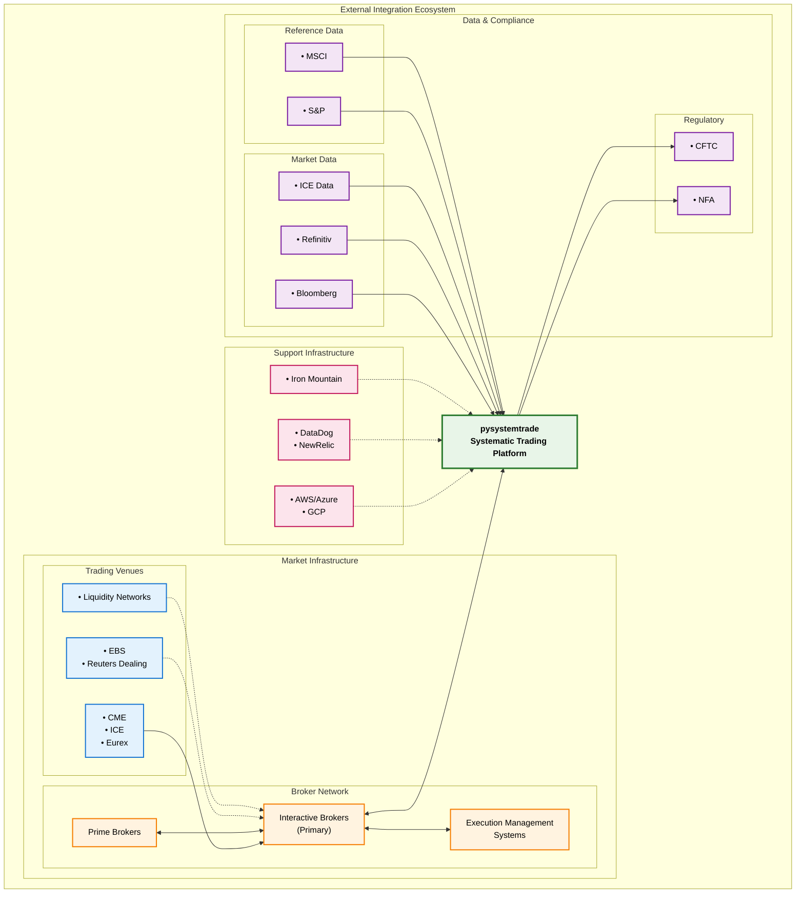

# Integration Architecture

External system integration patterns and communication protocols for pysystemtrade's enterprise trading ecosystem.

## Executive Summary

The integration architecture for pysystemtrade implements a **comprehensive integration strategy** that connects the systematic trading platform with external market participants, data providers, and regulatory systems. The architecture emphasizes **reliability**, **security**, and **performance** while maintaining **regulatory compliance** and **operational resilience**.

### **Integration Vision**
*"A secure, resilient, and high-performance integration platform that seamlessly connects pysystemtrade with the global financial ecosystem while maintaining strict compliance and risk controls."*

## Integration Landscape Overview

### **External System Ecosystem**



### **Integration Categories**

#### **1. Trading & Execution Integration (Mission Critical)**
- **Primary Broker** - Interactive Brokers (IB Gateway/TWS)
- **Prime Brokers** - Institution-grade execution venues
- **Direct Market Access** - Exchange connectivity (future)
- **Alternative Trading Systems** - Dark pools and ECNs

**Performance Requirements:**
- Latency: <50ms order routing
- Availability: 99.99% during trading hours
- Throughput: 1000+ orders/second capacity
- Recovery: <30 seconds failover time

#### **2. Market Data Integration (Performance Critical)**
- **Real-time Feeds** - Live price streams and market data
- **Historical Data** - Long-term price history and analytics
- **Reference Data** - Instrument specifications and corporate actions
- **Alternative Data** - News, sentiment, and fundamental data

**Performance Requirements:**
- Latency: <10ms for critical price updates
- Throughput: 100K+ price updates/second
- Completeness: 99.9% data capture rate
- Timeliness: Real-time with <1 second delay

#### **3. Risk & Compliance Integration (Regulatory Critical)**
- **Regulatory Reporting** - CFTC, NFA, and international regulators
- **Risk Management Systems** - External risk validation
- **Audit & Surveillance** - Transaction monitoring systems
- **Compliance Workflow** - Approval and oversight systems

**Performance Requirements:**
- Accuracy: 100% regulatory report accuracy
- Timeliness: Real-time regulatory reporting
- Auditability: Complete transaction audit trail
- Retention: 7+ year data retention compliance

## Integration Patterns & Protocols

### **Integration Architecture Patterns**

#### **1. Event-Driven Integration**
```python
# Event-driven integration for real-time processing
class MarketDataEventProcessor:
    """
    Process real-time market data events with high throughput
    """
    def __init__(self, event_bus: EventBus, processors: List[EventProcessor]):
        self.event_bus = event_bus
        self.processors = processors
        
        # Subscribe to relevant events
        self.event_bus.subscribe("market_data.*", self.handle_market_data_event)
        self.event_bus.subscribe("order_execution.*", self.handle_execution_event)
        
    async def handle_market_data_event(self, event: MarketDataEvent):
        """
        Handle market data event with parallel processing
        """
        try:
            # Validate event
            if not self._validate_event(event):
                await self._handle_invalid_event(event)
                return
                
            # Process event through registered processors
            processing_tasks = []
            for processor in self.processors:
                if processor.can_handle(event):
                    task = asyncio.create_task(processor.process(event))
                    processing_tasks.append(task)
                    
            # Wait for all processors to complete
            results = await asyncio.gather(*processing_tasks, return_exceptions=True)
            
            # Handle any processing errors
            for result in results:
                if isinstance(result, Exception):
                    await self._handle_processing_error(result, event)
                    
        except Exception as e:
            await self._handle_critical_error(e, event)
```

#### **2. Circuit Breaker Pattern**
```python
class IntegrationCircuitBreaker:
    """
    Circuit breaker for external system integration resilience
    """
    def __init__(self, failure_threshold: int = 5, recovery_timeout: int = 60):
        self.failure_threshold = failure_threshold
        self.recovery_timeout = recovery_timeout
        self.failure_count = 0
        self.last_failure_time = None
        self.state = CircuitState.CLOSED
        
    async def call_external_system(self, system_call: Callable, *args, **kwargs):
        """
        Execute external system call with circuit breaker protection
        """
        if self.state == CircuitState.OPEN:
            if self._should_attempt_reset():
                self.state = CircuitState.HALF_OPEN
            else:
                raise CircuitBreakerOpenException(
                    f"Circuit breaker open, last failure: {self.last_failure_time}"
                )
                
        try:
            result = await system_call(*args, **kwargs)
            
            # Success - reset circuit breaker
            if self.state == CircuitState.HALF_OPEN:
                self.state = CircuitState.CLOSED
                self.failure_count = 0
                
            return result
            
        except Exception as e:
            self._record_failure()
            
            if self.failure_count >= self.failure_threshold:
                self.state = CircuitState.OPEN
                self.last_failure_time = datetime.utcnow()
                
            raise IntegrationFailureException(f"External system call failed: {e}")
            
    def _should_attempt_reset(self) -> bool:
        """
        Check if circuit breaker should attempt reset
        """
        if self.last_failure_time is None:
            return True
            
        time_since_failure = (datetime.utcnow() - self.last_failure_time).total_seconds()
        return time_since_failure > self.recovery_timeout
```

#### **3. Adapter Pattern for Protocol Translation**
```python
class InteractiveBrokersAdapter:
    """
    Adapter for Interactive Brokers API integration
    """
    def __init__(self, ib_client: IB, order_translator: OrderTranslator):
        self.ib_client = ib_client
        self.order_translator = order_translator
        self.connection_monitor = ConnectionMonitor()
        
    async def submit_order(self, pysystem_order: Order) -> OrderSubmissionResult:
        """
        Submit order through Interactive Brokers with protocol translation
        """
        try:
            # 1. Validate connection
            if not await self._ensure_connection():
                raise IntegrationException("IB connection not available")
                
            # 2. Translate pysystemtrade order to IB order
            ib_order = self.order_translator.translate_to_ib_order(pysystem_order)
            
            # 3. Validate IB order
            validation_result = await self.ib_client.whatIfOrder(
                ib_order.contract, ib_order
            )
            
            if validation_result.initMarginChange == '':
                raise OrderValidationException("IB order validation failed")
                
            # 4. Submit order
            trade = self.ib_client.placeOrder(ib_order.contract, ib_order)
            
            # 5. Monitor order status
            self._start_order_monitoring(trade, pysystem_order.order_id)
            
            return OrderSubmissionResult(
                order_id=pysystem_order.order_id,
                external_order_id=trade.order.orderId,
                status=OrderStatus.SUBMITTED,
                submission_time=datetime.utcnow()
            )
            
        except Exception as e:
            return OrderSubmissionResult(
                order_id=pysystem_order.order_id,
                status=OrderStatus.REJECTED,
                rejection_reason=str(e)
            )
            
    async def _ensure_connection(self) -> bool:
        """
        Ensure IB connection is active with automatic reconnection
        """
        if not self.ib_client.isConnected():
            try:
                await self.ib_client.connectAsync()
                await asyncio.sleep(1)  # Allow connection to stabilize
                
                # Verify connection with a simple request
                await self.ib_client.reqCurrentTimeAsync()
                
                return True
                
            except Exception as e:
                self.connection_monitor.record_connection_failure(e)
                return False
                
        return True
```

### **Message Queue Architecture**

#### **Asynchronous Message Processing**
```python
class MessageQueueIntegration:
    """
    Redis-based message queue for asynchronous integration
    """
    def __init__(self, redis_client: Redis, topic_config: TopicConfiguration):
        self.redis_client = redis_client
        self.topic_config = topic_config
        self.message_processors = {}
        self.dead_letter_handler = DeadLetterHandler(redis_client)
        
    def publish_event(self, topic: str, event: dict, priority: int = 0):
        """
        Publish event to message queue with priority support
        """
        message = {
            'id': str(uuid.uuid4()),
            'topic': topic,
            'payload': event,
            'timestamp': datetime.utcnow().isoformat(),
            'priority': priority,
            'retry_count': 0
        }
        
        # Serialize message
        serialized_message = json.dumps(message, default=self._json_serializer)
        
        # Publish to priority queue
        if priority > 0:
            queue_name = f"{topic}:priority"
        else:
            queue_name = f"{topic}:normal"
            
        self.redis_client.lpush(queue_name, serialized_message)
        
    async def process_messages(self, topic: str):
        """
        Process messages from queue with error handling and retries
        """
        priority_queue = f"{topic}:priority"
        normal_queue = f"{topic}:normal"
        
        while True:
            try:
                # Process priority messages first
                message_data = self.redis_client.brpop(
                    [priority_queue, normal_queue], timeout=1
                )
                
                if message_data:
                    queue_name, message_json = message_data
                    message = json.loads(message_json)
                    
                    await self._process_single_message(topic, message)
                    
            except Exception as e:
                logging.error(f"Error processing messages for topic {topic}: {e}")
                await asyncio.sleep(5)  # Brief pause before retry
                
    async def _process_single_message(self, topic: str, message: dict):
        """
        Process individual message with retry logic
        """
        try:
            processor = self.message_processors.get(topic)
            if processor:
                await processor.process(message)
            else:
                logging.warning(f"No processor registered for topic: {topic}")
                
        except RetryableException as e:
            # Handle retryable errors
            if message['retry_count'] < self.topic_config.max_retries:
                message['retry_count'] += 1
                await self._schedule_retry(topic, message, e.retry_delay)
            else:
                await self.dead_letter_handler.handle_failed_message(message, e)
                
        except Exception as e:
            # Handle non-retryable errors
            await self.dead_letter_handler.handle_failed_message(message, e)
```

## Broker Integration Deep Dive

### **Interactive Brokers Integration Architecture**

#### **Connection Management**
```python
class IBConnectionManager:
    """
    Sophisticated connection management for Interactive Brokers
    """
    def __init__(self, config: IBConfig):
        self.config = config
        self.primary_connection = None
        self.backup_connections = []
        self.connection_pool = ConnectionPool(max_connections=5)
        self.health_monitor = ConnectionHealthMonitor()
        
    async def get_connection(self) -> IBConnection:
        """
        Get healthy connection with automatic failover
        """
        # Try primary connection first
        if self.primary_connection and await self._is_connection_healthy(self.primary_connection):
            return self.primary_connection
            
        # Primary failed, try backup connections
        for backup in self.backup_connections:
            if await self._is_connection_healthy(backup):
                logging.info(f"Failing over to backup connection: {backup.client_id}")
                self.primary_connection = backup
                return backup
                
        # All connections failed, create new connection
        new_connection = await self._create_new_connection()
        self.primary_connection = new_connection
        return new_connection
        
    async def _create_new_connection(self) -> IBConnection:
        """
        Create new IB connection with proper configuration
        """
        client_id = self._get_next_client_id()
        
        ib = IB()
        await ib.connectAsync(
            host=self.config.host,
            port=self.config.port,
            clientId=client_id,
            timeout=self.config.connection_timeout
        )
        
        # Configure connection settings
        await self._configure_connection(ib)
        
        connection = IBConnection(ib, client_id)
        self.connection_pool.add_connection(connection)
        
        return connection
        
    async def _configure_connection(self, ib: IB):
        """
        Configure IB connection with optimal settings
        """
        # Request account updates
        await ib.reqAccountUpdatesAsync(True, "")
        
        # Set up error handling
        ib.errorEvent += self._handle_ib_error
        
        # Configure market data subscriptions
        for contract in self.config.subscribed_contracts:
            await ib.reqMktDataAsync(contract, '', False, False)
            
    def _handle_ib_error(self, reqId, errorCode, errorString, contract):
        """
        Handle IB API errors with appropriate responses
        """
        error_severity = self._classify_error_severity(errorCode)
        
        if error_severity == ErrorSeverity.CRITICAL:
            # Connection lost or system error
            self.health_monitor.record_critical_error(errorCode, errorString)
            asyncio.create_task(self._handle_critical_error(errorCode))
            
        elif error_severity == ErrorSeverity.WARNING:
            # Order rejected or market data issue
            logging.warning(f"IB Warning {errorCode}: {errorString}")
            
        else:
            # Informational message
            logging.debug(f"IB Info {errorCode}: {errorString}")
```

#### **Order Management Integration**
```python
class IBOrderManager:
    """
    Comprehensive order management through Interactive Brokers
    """
    def __init__(self, connection_manager: IBConnectionManager,
                 order_tracker: OrderTracker):
        self.connection_manager = connection_manager
        self.order_tracker = order_tracker
        self.execution_algorithms = ExecutionAlgorithmFactory()
        
    async def submit_order_with_algorithm(self, order: Order, 
                                        algorithm: ExecutionAlgorithm) -> OrderResult:
        """
        Submit order using specified execution algorithm
        """
        connection = await self.connection_manager.get_connection()
        
        try:
            # 1. Select appropriate execution algorithm
            algo_implementation = self.execution_algorithms.get_algorithm(algorithm.type)
            
            # 2. Create IB order with algorithm parameters
            ib_order = await algo_implementation.create_ib_order(
                order, algorithm.parameters
            )
            
            # 3. Pre-flight validation
            validation_result = await self._validate_order_pre_submission(
                connection, ib_order
            )
            
            if not validation_result.valid:
                return OrderResult.rejected(order.order_id, validation_result.reason)
                
            # 4. Submit order with monitoring
            trade = connection.ib.placeOrder(ib_order.contract, ib_order)
            
            # 5. Set up comprehensive monitoring
            monitoring_task = asyncio.create_task(
                self._monitor_order_execution(trade, order.order_id, algorithm)
            )
            
            # 6. Track order in system
            self.order_tracker.track_order(order.order_id, trade.order.orderId, monitoring_task)
            
            return OrderResult.submitted(order.order_id, trade.order.orderId)
            
        except Exception as e:
            return OrderResult.error(order.order_id, str(e))
            
    async def _monitor_order_execution(self, trade: Trade, 
                                     internal_order_id: str,
                                     algorithm: ExecutionAlgorithm):
        """
        Monitor order execution with algorithm-specific logic
        """
        start_time = datetime.utcnow()
        last_status = trade.orderStatus.status
        
        while not trade.isDone():
            await asyncio.sleep(0.1)  # 100ms monitoring interval
            
            current_status = trade.orderStatus.status
            
            # Check for status changes
            if current_status != last_status:
                await self._handle_status_change(
                    internal_order_id, last_status, current_status, trade
                )
                last_status = current_status
                
            # Check algorithm-specific conditions
            if algorithm.should_modify_order(trade, datetime.utcnow() - start_time):
                modified_order = algorithm.modify_order(trade)
                if modified_order:
                    connection = await self.connection_manager.get_connection()
                    connection.ib.placeOrder(modified_order.contract, modified_order)
                    
            # Check timeout conditions
            if algorithm.is_timeout(datetime.utcnow() - start_time):
                await self._handle_algorithm_timeout(trade, internal_order_id, algorithm)
                break
                
        # Order completed - final processing
        await self._handle_order_completion(trade, internal_order_id)
```

### **Market Data Integration**

#### **Multi-Source Data Aggregation**
```python
class MarketDataAggregator:
    """
    Aggregate market data from multiple sources with quality controls
    """
    def __init__(self, data_sources: List[MarketDataSource],
                 quality_controller: DataQualityController):
        self.data_sources = data_sources
        self.quality_controller = quality_controller
        self.price_consolidator = PriceConsolidator()
        self.latency_monitor = LatencyMonitor()
        
    async def get_consolidated_price(self, instrument: str) -> ConsolidatedPrice:
        """
        Get consolidated price from multiple sources with quality validation
        """
        price_tasks = []
        
        # Request price from all sources in parallel
        for source in self.data_sources:
            if source.supports_instrument(instrument):
                task = asyncio.create_task(
                    self._get_price_with_timeout(source, instrument)
                )
                price_tasks.append((source.name, task))
                
        # Collect results as they complete
        source_prices = {}
        for source_name, task in price_tasks:
            try:
                price_data = await asyncio.wait_for(task, timeout=1.0)
                if self.quality_controller.validate_price(price_data):
                    source_prices[source_name] = price_data
                    self.latency_monitor.record_latency(source_name, price_data.latency)
                else:
                    logging.warning(f"Invalid price data from {source_name}")
                    
            except asyncio.TimeoutError:
                logging.warning(f"Timeout getting price from {source_name}")
            except Exception as e:
                logging.error(f"Error getting price from {source_name}: {e}")
                
        # Consolidate prices from valid sources
        if source_prices:
            consolidated = self.price_consolidator.consolidate(source_prices)
            return consolidated
        else:
            raise NoValidPriceDataException(f"No valid price data for {instrument}")
            
    async def _get_price_with_timeout(self, source: MarketDataSource, 
                                    instrument: str) -> PriceData:
        """
        Get price from source with performance monitoring
        """
        start_time = time.time()
        
        try:
            price_data = await source.get_current_price(instrument)
            latency = time.time() - start_time
            
            return PriceData(
                instrument=instrument,
                price=price_data.price,
                timestamp=price_data.timestamp,
                source=source.name,
                latency=latency
            )
            
        except Exception as e:
            # Convert source-specific exceptions to standard format
            raise MarketDataException(f"Failed to get price from {source.name}: {e}")

class PriceConsolidator:
    """
    Consolidate prices from multiple sources using various algorithms
    """
    def __init__(self, consolidation_method: str = "weighted_average"):
        self.consolidation_method = consolidation_method
        self.source_weights = self._initialize_source_weights()
        
    def consolidate(self, source_prices: Dict[str, PriceData]) -> ConsolidatedPrice:
        """
        Consolidate prices using configured method
        """
        if self.consolidation_method == "weighted_average":
            return self._weighted_average_consolidation(source_prices)
        elif self.consolidation_method == "median":
            return self._median_consolidation(source_prices)
        elif self.consolidation_method == "best_price":
            return self._best_price_consolidation(source_prices)
        else:
            raise ValueError(f"Unknown consolidation method: {self.consolidation_method}")
            
    def _weighted_average_consolidation(self, 
                                      source_prices: Dict[str, PriceData]) -> ConsolidatedPrice:
        """
        Calculate weighted average price based on source reliability
        """
        total_weight = 0
        weighted_price = 0
        latest_timestamp = None
        
        for source_name, price_data in source_prices.items():
            weight = self.source_weights.get(source_name, 1.0)
            
            # Adjust weight based on latency (lower latency = higher weight)
            latency_factor = max(0.1, 1.0 - (price_data.latency / 10.0))
            adjusted_weight = weight * latency_factor
            
            weighted_price += price_data.price * adjusted_weight
            total_weight += adjusted_weight
            
            # Track latest timestamp
            if latest_timestamp is None or price_data.timestamp > latest_timestamp:
                latest_timestamp = price_data.timestamp
                
        if total_weight == 0:
            raise ConsolidationException("No valid weights for price consolidation")
            
        consolidated_price = weighted_price / total_weight
        
        return ConsolidatedPrice(
            price=consolidated_price,
            timestamp=latest_timestamp,
            source_count=len(source_prices),
            confidence=self._calculate_confidence(source_prices, consolidated_price)
        )
```

## Regulatory & Compliance Integration

### **Regulatory Reporting Architecture**

#### **Real-Time Regulatory Reporting**
```python
class RegulatoryReportingService:
    """
    Real-time regulatory reporting with multiple jurisdiction support
    """
    def __init__(self, reporting_engines: Dict[str, ReportingEngine],
                 compliance_rules: ComplianceRulesEngine):
        self.reporting_engines = reporting_engines
        self.compliance_rules = compliance_rules
        self.report_queue = PriorityQueue()
        self.transmission_monitor = TransmissionMonitor()
        
    async def report_transaction(self, transaction: Transaction) -> ReportingResult:
        """
        Report transaction to all required regulatory bodies
        """
        # 1. Determine reporting requirements
        reporting_requirements = self.compliance_rules.get_reporting_requirements(
            transaction
        )
        
        reporting_tasks = []
        
        # 2. Generate reports for each required jurisdiction
        for requirement in reporting_requirements:
            reporting_engine = self.reporting_engines.get(requirement.jurisdiction)
            
            if reporting_engine:
                # Create reporting task
                task = asyncio.create_task(
                    self._generate_and_submit_report(
                        reporting_engine, transaction, requirement
                    )
                )
                reporting_tasks.append((requirement.jurisdiction, task))
                
        # 3. Execute all reporting tasks
        results = {}
        for jurisdiction, task in reporting_tasks:
            try:
                result = await task
                results[jurisdiction] = result
                
                # Monitor transmission success
                self.transmission_monitor.record_transmission(
                    jurisdiction, result.success, result.response_time
                )
                
            except Exception as e:
                results[jurisdiction] = ReportingResult.failed(str(e))
                logging.error(f"Regulatory reporting failed for {jurisdiction}: {e}")
                
        return RegulatoryReportingResult(transaction.id, results)
        
    async def _generate_and_submit_report(self, engine: ReportingEngine,
                                        transaction: Transaction,
                                        requirement: ReportingRequirement) -> ReportingResult:
        """
        Generate and submit regulatory report
        """
        try:
            # 1. Generate report in required format
            report = engine.generate_report(transaction, requirement.report_type)
            
            # 2. Validate report against regulatory schema
            validation_result = engine.validate_report(report)
            if not validation_result.valid:
                return ReportingResult.validation_failed(validation_result.errors)
                
            # 3. Submit report to regulatory system
            submission_result = await engine.submit_report(
                report, requirement.submission_method
            )
            
            # 4. Handle submission response
            if submission_result.acknowledged:
                return ReportingResult.successful(
                    submission_result.reference_id,
                    submission_result.response_time
                )
            else:
                return ReportingResult.rejected(submission_result.rejection_reason)
                
        except Exception as e:
            return ReportingResult.error(str(e))

class CFTCReportingEngine(ReportingEngine):
    """
    CFTC-specific regulatory reporting implementation
    """
    def __init__(self, cftc_config: CFTCConfig):
        self.config = cftc_config
        self.schema_validator = CFTCSchemaValidator()
        self.submission_client = CFTCSubmissionClient(cftc_config)
        
    def generate_report(self, transaction: Transaction, 
                       report_type: ReportType) -> CFTCReport:
        """
        Generate CFTC-compliant report
        """
        if report_type == ReportType.LARGE_TRADER_REPORT:
            return self._generate_large_trader_report(transaction)
        elif report_type == ReportType.SWAP_DATA_REPORT:
            return self._generate_swap_data_report(transaction)
        else:
            raise UnsupportedReportTypeException(f"Unsupported report type: {report_type}")
            
    def _generate_large_trader_report(self, transaction: Transaction) -> CFTCReport:
        """
        Generate CFTC Large Trader Report (Form 40)
        """
        report = CFTCLargeTraderReport()
        
        # Populate required fields
        report.reporting_firm = self.config.reporting_firm_id
        report.report_date = transaction.trade_date
        report.trader_id = self.config.trader_id
        
        # Position data
        report.long_positions = transaction.long_positions
        report.short_positions = transaction.short_positions
        report.net_positions = transaction.net_positions
        
        # Contract details
        report.contract_details = self._map_contract_details(transaction.contract)
        
        # Risk metrics
        report.notional_value = transaction.notional_value
        report.delta_equivalent = transaction.delta_equivalent
        
        return report
        
    async def submit_report(self, report: CFTCReport, 
                          submission_method: SubmissionMethod) -> SubmissionResult:
        """
        Submit report to CFTC systems
        """
        if submission_method == SubmissionMethod.ELECTRONIC:
            return await self._submit_electronic(report)
        elif submission_method == SubmissionMethod.FILE_TRANSFER:
            return await self._submit_file_transfer(report)
        else:
            raise UnsupportedSubmissionMethodException(
                f"Unsupported submission method: {submission_method}"
            )
```

## Performance & Scalability

### **Integration Performance Optimization**

#### **Connection Pooling & Load Balancing**
```python
class IntegrationConnectionPool:
    """
    High-performance connection pool for external integrations
    """
    def __init__(self, config: ConnectionPoolConfig):
        self.config = config
        self.connections: Dict[str, List[Connection]] = {}
        self.connection_stats = ConnectionStatistics()
        self.health_checker = ConnectionHealthChecker()
        
    async def get_connection(self, service_name: str, 
                           load_balancing: LoadBalancingStrategy = None) -> Connection:
        """
        Get connection with intelligent load balancing
        """
        service_connections = self.connections.get(service_name, [])
        
        if not service_connections:
            # No existing connections, create new one
            connection = await self._create_connection(service_name)
            self.connections[service_name] = [connection]
            return connection
            
        # Filter healthy connections
        healthy_connections = []
        for conn in service_connections:
            if await self.health_checker.is_healthy(conn):
                healthy_connections.append(conn)
            else:
                # Remove unhealthy connection
                await self._remove_connection(service_name, conn)
                
        if not healthy_connections:
            # All connections unhealthy, create new one
            connection = await self._create_connection(service_name)
            self.connections[service_name] = [connection]
            return connection
            
        # Select connection using load balancing strategy
        if load_balancing is None:
            load_balancing = LoadBalancingStrategy.ROUND_ROBIN
            
        return self._select_connection(healthy_connections, load_balancing)
        
    def _select_connection(self, connections: List[Connection],
                         strategy: LoadBalancingStrategy) -> Connection:
        """
        Select connection based on load balancing strategy
        """
        if strategy == LoadBalancingStrategy.ROUND_ROBIN:
            return connections[self.connection_stats.get_round_robin_index(len(connections))]
            
        elif strategy == LoadBalancingStrategy.LEAST_BUSY:
            return min(connections, key=lambda c: c.active_requests)
            
        elif strategy == LoadBalancingStrategy.RESPONSE_TIME:
            return min(connections, key=lambda c: c.average_response_time)
            
        else:
            # Default to random selection
            return random.choice(connections)
```

#### **Caching Strategy for Integration Data**
```python
class IntegrationCacheManager:
    """
    Multi-layer caching for integration data
    """
    def __init__(self, redis_client: Redis, local_cache_size: int = 10000):
        self.redis_client = redis_client
        self.local_cache = LRUCache(local_cache_size)
        self.cache_metrics = CacheMetrics()
        
    async def get_cached_data(self, cache_key: str, 
                            data_fetcher: Callable = None,
                            ttl: int = 300) -> Any:
        """
        Get data with multi-layer caching strategy
        """
        # L1 Cache - Local memory
        local_result = self.local_cache.get(cache_key)
        if local_result is not None:
            self.cache_metrics.record_hit('L1')
            return local_result
            
        # L2 Cache - Redis distributed cache  
        redis_result = await self.redis_client.get(cache_key)
        if redis_result is not None:
            # Deserialize and promote to L1 cache
            data = self._deserialize(redis_result)
            self.local_cache.put(cache_key, data)
            self.cache_metrics.record_hit('L2')
            return data
            
        # Cache miss - fetch from source
        if data_fetcher is None:
            self.cache_metrics.record_miss()
            return None
            
        try:
            # Fetch data from external source
            fresh_data = await data_fetcher()
            
            # Store in both cache levels
            self.local_cache.put(cache_key, fresh_data)
            await self.redis_client.setex(
                cache_key, ttl, self._serialize(fresh_data)
            )
            
            self.cache_metrics.record_miss()
            return fresh_data
            
        except Exception as e:
            # Cache the exception for a short time to prevent cascade failures
            await self.redis_client.setex(
                f"{cache_key}:error", 60, str(e)
            )
            raise
```

## Security & Compliance

### **Integration Security Framework**

#### **API Security & Authentication**
```python
class IntegrationSecurityManager:
    """
    Comprehensive security management for external integrations
    """
    def __init__(self, security_config: SecurityConfig):
        self.config = security_config
        self.token_manager = TokenManager()
        self.encryption_service = EncryptionService()
        self.audit_logger = AuditLogger()
        
    async def secure_api_call(self, api_client: APIClient,
                            request: APIRequest) -> APIResponse:
        """
        Execute API call with comprehensive security controls
        """
        # 1. Authentication
        authenticated_request = await self._authenticate_request(request)
        
        # 2. Authorization
        if not await self._authorize_request(authenticated_request):
            raise UnauthorizedAccessException("Request not authorized")
            
        # 3. Input validation and sanitization
        validated_request = self._validate_and_sanitize(authenticated_request)
        
        # 4. Encrypt sensitive data
        encrypted_request = await self._encrypt_sensitive_data(validated_request)
        
        # 5. Execute request with monitoring
        start_time = time.time()
        
        try:
            response = await api_client.execute(encrypted_request)
            
            # 6. Validate response
            validated_response = self._validate_response(response)
            
            # 7. Decrypt response data
            decrypted_response = await self._decrypt_response_data(validated_response)
            
            # 8. Audit successful call
            self.audit_logger.log_successful_api_call(
                request.endpoint,
                request.method,
                time.time() - start_time
            )
            
            return decrypted_response
            
        except Exception as e:
            # Audit failed call
            self.audit_logger.log_failed_api_call(
                request.endpoint,
                request.method,
                str(e),
                time.time() - start_time
            )
            raise
            
    async def _authenticate_request(self, request: APIRequest) -> APIRequest:
        """
        Add authentication credentials to request
        """
        # Get fresh authentication token
        auth_token = await self.token_manager.get_valid_token(request.service)
        
        # Add authentication header
        request.headers['Authorization'] = f"Bearer {auth_token.token}"
        
        # Add API key if required
        if request.service in self.config.api_key_services:
            api_key = await self.token_manager.get_api_key(request.service)
            request.headers['X-API-Key'] = api_key
            
        return request
        
    def _validate_and_sanitize(self, request: APIRequest) -> APIRequest:
        """
        Validate and sanitize request data
        """
        # Input validation
        validator = InputValidator.for_service(request.service)
        validation_result = validator.validate(request.data)
        
        if not validation_result.valid:
            raise ValidationException(f"Request validation failed: {validation_result.errors}")
            
        # Sanitize input data
        sanitized_data = self._sanitize_input_data(request.data)
        request.data = sanitized_data
        
        return request
        
    def _sanitize_input_data(self, data: dict) -> dict:
        """
        Sanitize input data to prevent injection attacks
        """
        sanitized = {}
        
        for key, value in data.items():
            if isinstance(value, str):
                # Remove potentially dangerous characters
                sanitized_value = re.sub(r'[<>"\';]', '', value)
                sanitized[key] = sanitized_value
            elif isinstance(value, dict):
                sanitized[key] = self._sanitize_input_data(value)
            else:
                sanitized[key] = value
                
        return sanitized
```

---

**Next:** [Deployment Architecture](05-deployment-architecture.md) - Production deployment patterns and infrastructure strategies