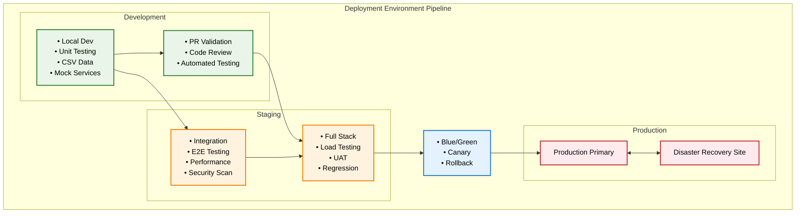
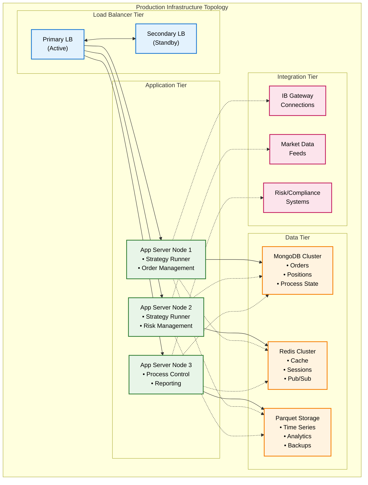

# Deployment Architecture

Production deployment patterns and infrastructure strategies for pysystemtrade's enterprise systematic trading platform.

## Executive Summary

The deployment architecture for pysystemtrade implements a **robust, scalable, and secure infrastructure strategy** designed for 24/7 systematic trading operations. The architecture emphasizes **high availability**, **disaster recovery**, and **operational excellence** while maintaining **cost efficiency** and **regulatory compliance**.

### **Deployment Vision**
*"A resilient, automated, and scalable deployment platform that ensures continuous trading operations with zero downtime deployments, comprehensive monitoring, and rapid disaster recovery capabilities."*

## Infrastructure Strategy Overview

### **Deployment Architecture Principles**

#### **1. High Availability Design**
- **Multi-Zone Deployment** - Distribution across availability zones
- **Active-Passive Clustering** - Hot standby systems for critical components
- **Load Balancing** - Traffic distribution across healthy instances
- **Circuit Breakers** - Automatic failure isolation and recovery

#### **2. Infrastructure as Code (IaC)**
- **Declarative Configuration** - All infrastructure defined in code
- **Version Control** - Infrastructure changes tracked and reviewed
- **Automated Provisioning** - Consistent environment creation
- **Immutable Infrastructure** - No manual server modifications

#### **3. Zero-Downtime Operations**
- **Blue-Green Deployments** - Seamless production updates
- **Rolling Updates** - Gradual service updates with validation
- **Canary Releases** - Risk-minimized feature rollouts
- **Database Migrations** - Schema changes without downtime

#### **4. Comprehensive Monitoring**
- **Real-time Metrics** - System and application performance monitoring
- **Distributed Tracing** - End-to-end transaction visibility
- **Centralized Logging** - Unified log collection and analysis
- **Proactive Alerting** - Early warning systems for issues

### **Deployment Environments**



## Production Infrastructure Architecture

### **Multi-Tier Infrastructure Design**



### **Container Orchestration Strategy**

#### **Docker-Based Application Packaging**
```dockerfile
# Multi-stage Docker build for pysystemtrade
FROM python:3.10-slim as base

# System dependencies
RUN apt-get update && apt-get install -y \
    gcc \
    g++ \
    libpq-dev \
    curl \
    && rm -rf /var/lib/apt/lists/*

# Create application user
RUN groupadd -r pysystem && useradd -r -g pysystem pysystem

# Set working directory
WORKDIR /app

# Copy requirements
COPY requirements.txt .
COPY requirements-prod.txt .

# Install Python dependencies
RUN pip install --no-cache-dir -r requirements-prod.txt

# Production stage
FROM base as production

# Copy application code
COPY --chown=pysystem:pysystem . .

# Set environment variables
ENV PYTHONPATH=/app
ENV PYTHONUNBUFFERED=1
ENV PYTHONDONTWRITEBYTECODE=1

# Health check
HEALTHCHECK --interval=30s --timeout=10s --start-period=60s --retries=3 \
    CMD python scripts/health_check.py || exit 1

# Run as non-root user
USER pysystem

# Default command
CMD ["python", "sysproduction/linux/scripts/run_processes.py"]
```

#### **Kubernetes Deployment Configuration**
```yaml
# Kubernetes deployment for pysystemtrade
apiVersion: apps/v1
kind: Deployment
metadata:
  name: pysystemtrade-strategy-runner
  labels:
    app: pysystemtrade
    component: strategy-runner
spec:
  replicas: 2
  strategy:
    type: RollingUpdate
    rollingUpdate:
      maxUnavailable: 1
      maxSurge: 1
  selector:
    matchLabels:
      app: pysystemtrade
      component: strategy-runner
  template:
    metadata:
      labels:
        app: pysystemtrade
        component: strategy-runner
    spec:
      serviceAccountName: pysystemtrade
      securityContext:
        runAsNonRoot: true
        runAsUser: 1000
        fsGroup: 1000
      containers:
      - name: strategy-runner
        image: pysystemtrade:latest
        imagePullPolicy: Always
        ports:
        - containerPort: 8080
          name: http
        env:
        - name: MONGO_HOST
          valueFrom:
            secretKeyRef:
              name: pysystemtrade-secrets
              key: mongo_host
        - name: MONGO_PASSWORD
          valueFrom:
            secretKeyRef:
              name: pysystemtrade-secrets
              key: mongo_password
        - name: IB_USERNAME
          valueFrom:
            secretKeyRef:
              name: pysystemtrade-secrets
              key: ib_username
        - name: IB_PASSWORD
          valueFrom:
            secretKeyRef:
              name: pysystemtrade-secrets
              key: ib_password
        resources:
          requests:
            cpu: 500m
            memory: 1Gi
          limits:
            cpu: 2000m
            memory: 4Gi
        livenessProbe:
          httpGet:
            path: /health
            port: 8080
          initialDelaySeconds: 60
          periodSeconds: 30
          timeoutSeconds: 10
          failureThreshold: 3
        readinessProbe:
          httpGet:
            path: /ready
            port: 8080
          initialDelaySeconds: 30
          periodSeconds: 10
          timeoutSeconds: 5
        volumeMounts:
        - name: config
          mountPath: /app/private
          readOnly: true
        - name: data
          mountPath: /app/data
      volumes:
      - name: config
        secret:
          secretName: pysystemtrade-config
      - name: data
        persistentVolumeClaim:
          claimName: pysystemtrade-data
      nodeSelector:
        workload-type: trading
      tolerations:
      - key: "trading-workload"
        operator: "Equal"
        value: "true"
        effect: "NoSchedule"
```

### **Infrastructure as Code Implementation**

#### **Terraform Infrastructure Definition**
```hcl
# Terraform configuration for pysystemtrade infrastructure
terraform {
  required_version = ">= 1.0"
  
  required_providers {
    aws = {
      source  = "hashicorp/aws"
      version = "~> 5.0"
    }
    kubernetes = {
      source  = "hashicorp/kubernetes"
      version = "~> 2.0"
    }
  }
  
  backend "s3" {
    bucket         = "pysystemtrade-terraform-state"
    key            = "prod/terraform.tfstate"
    region         = "us-east-1"
    encrypt        = true
    dynamodb_table = "pysystemtrade-terraform-locks"
  }
}

# VPC and Networking
module "vpc" {
  source = "terraform-aws-modules/vpc/aws"
  
  name = "pysystemtrade-vpc"
  cidr = "10.0.0.0/16"
  
  azs             = ["us-east-1a", "us-east-1b", "us-east-1c"]
  private_subnets = ["10.0.1.0/24", "10.0.2.0/24", "10.0.3.0/24"]
  public_subnets  = ["10.0.101.0/24", "10.0.102.0/24", "10.0.103.0/24"]
  
  enable_nat_gateway = true
  enable_vpn_gateway = true
  
  enable_dns_hostnames = true
  enable_dns_support   = true
  
  tags = {
    Environment = "production"
    Application = "pysystemtrade"
    Terraform   = "true"
  }
}

# EKS Cluster
module "eks" {
  source = "terraform-aws-modules/eks/aws"
  
  cluster_name    = "pysystemtrade-cluster"
  cluster_version = "1.24"
  
  vpc_id     = module.vpc.vpc_id
  subnet_ids = module.vpc.private_subnets
  
  # Cluster access
  cluster_endpoint_private_access = true
  cluster_endpoint_public_access  = true
  cluster_endpoint_public_access_cidrs = ["10.0.0.0/8"]
  
  # Node groups
  eks_managed_node_groups = {
    trading_nodes = {
      min_size     = 2
      max_size     = 10
      desired_size = 4
      
      instance_types = ["m5.xlarge"]
      
      k8s_labels = {
        Environment = "production"
        NodeGroup   = "trading"
      }
      
      taints = [
        {
          key    = "trading-workload"
          value  = "true"
          effect = "NO_SCHEDULE"
        }
      ]
    }
  }
  
  tags = {
    Environment = "production"
    Application = "pysystemtrade"
  }
}

# RDS for MongoDB (DocumentDB)
resource "aws_docdb_cluster" "pysystemtrade" {
  cluster_identifier      = "pysystemtrade-docdb"
  engine                 = "docdb"
  master_username        = var.docdb_master_username
  master_password        = var.docdb_master_password
  backup_retention_period = 7
  preferred_backup_window = "07:00-09:00"
  skip_final_snapshot    = false
  
  vpc_security_group_ids = [aws_security_group.docdb.id]
  db_subnet_group_name   = aws_docdb_subnet_group.pysystemtrade.name
  
  enabled_cloudwatch_logs_exports = ["audit", "profiler"]
  
  tags = {
    Name        = "pysystemtrade-docdb"
    Environment = "production"
  }
}

resource "aws_docdb_cluster_instance" "pysystemtrade" {
  count              = 2
  identifier         = "pysystemtrade-docdb-${count.index}"
  cluster_identifier = aws_docdb_cluster.pysystemtrade.id
  instance_class     = "db.r5.large"
}

# ElastiCache Redis Cluster
resource "aws_elasticache_replication_group" "pysystemtrade" {
  description        = "pysystemtrade Redis cluster"
  replication_group_id = "pysystemtrade-redis"
  
  num_cache_clusters = 3
  node_type         = "cache.r6g.large"
  port             = 6379
  parameter_group_name = "default.redis6.x"
  
  subnet_group_name = aws_elasticache_subnet_group.pysystemtrade.name
  security_group_ids = [aws_security_group.redis.id]
  
  at_rest_encryption_enabled = true
  transit_encryption_enabled = true
  
  tags = {
    Name        = "pysystemtrade-redis"
    Environment = "production"
  }
}

# S3 for Parquet data storage
resource "aws_s3_bucket" "pysystemtrade_data" {
  bucket = "pysystemtrade-data-${random_id.bucket_suffix.hex}"
  
  tags = {
    Name        = "pysystemtrade-data"
    Environment = "production"
  }
}

resource "aws_s3_bucket_versioning" "pysystemtrade_data" {
  bucket = aws_s3_bucket.pysystemtrade_data.id
  versioning_configuration {
    status = "Enabled"
  }
}

resource "aws_s3_bucket_server_side_encryption_configuration" "pysystemtrade_data" {
  bucket = aws_s3_bucket.pysystemtrade_data.id
  
  rule {
    apply_server_side_encryption_by_default {
      sse_algorithm = "AES256"
    }
  }
}
```

## Deployment Pipeline & CI/CD

### **GitOps-Based Deployment Pipeline**

#### **GitHub Actions Workflow**
```yaml
# .github/workflows/production-deploy.yml
name: Production Deployment Pipeline

on:
  push:
    branches: [main]
    paths-ignore:
      - 'docs/**'
      - '*.md'
  pull_request:
    branches: [main]

env:
  REGISTRY: ghcr.io
  IMAGE_NAME: ${{ github.repository }}

jobs:
  test:
    name: Run Tests
    runs-on: ubuntu-latest
    strategy:
      matrix:
        python-version: ['3.10', '3.11']
    
    steps:
    - uses: actions/checkout@v3
    
    - name: Set up Python ${{ matrix.python-version }}
      uses: actions/setup-python@v4
      with:
        python-version: ${{ matrix.python-version }}
        
    - name: Cache dependencies
      uses: actions/cache@v3
      with:
        path: ~/.cache/pip
        key: ${{ runner.os }}-pip-${{ hashFiles('**/requirements.txt') }}
        
    - name: Install dependencies
      run: |
        python -m pip install --upgrade pip
        pip install -e .[dev]
        
    - name: Run tests
      run: |
        python -m pytest --cov=sysproduction --cov-report=xml
        
    - name: Upload coverage
      uses: codecov/codecov-action@v3
      
  security-scan:
    name: Security Scanning
    runs-on: ubuntu-latest
    
    steps:
    - uses: actions/checkout@v3
    
    - name: Run security scan
      uses: pypa/gh-action-pip-audit@v1.0.8
      with:
        inputs: requirements.txt
        
    - name: Run Snyk security scan
      uses: snyk/actions/python@master
      env:
        SNYK_TOKEN: ${{ secrets.SNYK_TOKEN }}
      with:
        command: test
        args: --severity-threshold=high
        
  build-and-push:
    name: Build and Push Docker Image
    runs-on: ubuntu-latest
    needs: [test, security-scan]
    if: github.ref == 'refs/heads/main'
    
    permissions:
      contents: read
      packages: write
      
    steps:
    - uses: actions/checkout@v3
    
    - name: Set up Docker Buildx
      uses: docker/setup-buildx-action@v2
      
    - name: Log in to Container Registry
      uses: docker/login-action@v2
      with:
        registry: ${{ env.REGISTRY }}
        username: ${{ github.actor }}
        password: ${{ secrets.GITHUB_TOKEN }}
        
    - name: Extract metadata
      id: meta
      uses: docker/metadata-action@v4
      with:
        images: ${{ env.REGISTRY }}/${{ env.IMAGE_NAME }}
        tags: |
          type=ref,event=branch
          type=ref,event=pr
          type=sha,prefix={{branch}}-
          type=raw,value=latest,enable={{is_default_branch}}
          
    - name: Build and push Docker image
      uses: docker/build-push-action@v4
      with:
        context: .
        platforms: linux/amd64,linux/arm64
        push: true
        tags: ${{ steps.meta.outputs.tags }}
        labels: ${{ steps.meta.outputs.labels }}
        cache-from: type=gha
        cache-to: type=gha,mode=max
        
  deploy-staging:
    name: Deploy to Staging
    runs-on: ubuntu-latest
    needs: build-and-push
    environment: staging
    
    steps:
    - uses: actions/checkout@v3
    
    - name: Configure kubectl
      uses: azure/k8s-set-context@v1
      with:
        method: kubeconfig
        kubeconfig: ${{ secrets.KUBE_CONFIG_STAGING }}
        
    - name: Deploy to staging
      run: |
        helm upgrade --install pysystemtrade-staging ./helm/pysystemtrade \
          --namespace staging \
          --set image.tag=${{ github.sha }} \
          --set environment=staging \
          --wait --timeout=10m
          
    - name: Run integration tests
      run: |
        python scripts/run_integration_tests.py --environment=staging
        
  deploy-production:
    name: Deploy to Production
    runs-on: ubuntu-latest
    needs: deploy-staging
    environment: production
    if: github.ref == 'refs/heads/main'
    
    steps:
    - uses: actions/checkout@v3
    
    - name: Configure kubectl
      uses: azure/k8s-set-context@v1
      with:
        method: kubeconfig
        kubeconfig: ${{ secrets.KUBE_CONFIG_PRODUCTION }}
        
    - name: Blue-Green Deployment
      run: |
        # Deploy to green environment
        helm upgrade --install pysystemtrade-green ./helm/pysystemtrade \
          --namespace production \
          --set image.tag=${{ github.sha }} \
          --set environment=production-green \
          --set service.name=pysystemtrade-green \
          --wait --timeout=15m
          
        # Health check on green environment
        python scripts/health_check.py --environment=production-green
        
        # Switch traffic to green
        kubectl patch service pysystemtrade-production \
          --patch '{"spec":{"selector":{"version":"green"}}}'
          
        # Wait for traffic switch to complete
        sleep 60
        
        # Final health check
        python scripts/health_check.py --environment=production
        
        # Clean up old blue environment
        helm uninstall pysystemtrade-blue --namespace production || true
        
        # Rename green to blue for next deployment
        helm upgrade pysystemtrade-blue ./helm/pysystemtrade \
          --reuse-values \
          --set service.name=pysystemtrade-blue
```

### **Helm Chart Configuration**

#### **Production Helm Values**
```yaml
# helm/pysystemtrade/values-production.yaml
replicaCount: 3

image:
  repository: ghcr.io/your-org/pysystemtrade
  pullPolicy: Always
  tag: "latest"

strategy:
  type: RollingUpdate
  rollingUpdate:
    maxUnavailable: 1
    maxSurge: 1

service:
  type: LoadBalancer
  port: 80
  targetPort: 8080
  
  annotations:
    service.beta.kubernetes.io/aws-load-balancer-type: "nlb"
    service.beta.kubernetes.io/aws-load-balancer-cross-zone-load-balancing-enabled: "true"

ingress:
  enabled: true
  className: "nginx"
  annotations:
    kubernetes.io/ingress.class: nginx
    cert-manager.io/cluster-issuer: "letsencrypt-prod"
    nginx.ingress.kubernetes.io/ssl-redirect: "true"
    nginx.ingress.kubernetes.io/force-ssl-redirect: "true"
  hosts:
    - host: trading.your-domain.com
      paths:
        - path: /
          pathType: Prefix
  tls:
    - secretName: pysystemtrade-tls
      hosts:
        - trading.your-domain.com

resources:
  limits:
    cpu: 4000m
    memory: 8Gi
  requests:
    cpu: 1000m
    memory: 2Gi

autoscaling:
  enabled: true
  minReplicas: 3
  maxReplicas: 10
  targetCPUUtilizationPercentage: 70
  targetMemoryUtilizationPercentage: 80

nodeSelector:
  workload-type: trading

tolerations:
  - key: "trading-workload"
    operator: "Equal"
    value: "true"
    effect: "NoSchedule"

affinity:
  podAntiAffinity:
    preferredDuringSchedulingIgnoredDuringExecution:
      - weight: 100
        podAffinityTerm:
          labelSelector:
            matchExpressions:
              - key: app.kubernetes.io/name
                operator: In
                values:
                  - pysystemtrade
          topologyKey: kubernetes.io/hostname

persistence:
  enabled: true
  storageClass: "gp3"
  size: 100Gi
  accessMode: ReadWriteOnce

mongodb:
  enabled: false  # Using managed DocumentDB
  
redis:
  enabled: false  # Using managed ElastiCache

config:
  mongo_host: "pysystemtrade-docdb-cluster.cluster-xxx.docdb.us-east-1.amazonaws.com"
  redis_host: "pysystemtrade-redis.xxx.cache.amazonaws.com"
  
  # Strategy configuration
  strategies:
    - name: "momentum_strategy"
      capital_allocation: 0.4
      risk_limit: 0.02
    - name: "mean_reversion_strategy"
      capital_allocation: 0.3
      risk_limit: 0.015
    - name: "carry_strategy"
      capital_allocation: 0.3
      risk_limit: 0.015

secrets:
  mongo_password: ""  # Injected from external secret manager
  ib_username: ""
  ib_password: ""
  api_keys: {}

monitoring:
  enabled: true
  serviceMonitor:
    enabled: true
    interval: 30s
    scrapeTimeout: 10s

logging:
  level: INFO
  format: json
  output: stdout
  
healthcheck:
  enabled: true
  path: /health
  initialDelaySeconds: 60
  periodSeconds: 30
  timeoutSeconds: 10
  failureThreshold: 3

readinessProbe:
  enabled: true
  path: /ready
  initialDelaySeconds: 30
  periodSeconds: 10
  timeoutSeconds: 5
```

## High Availability & Disaster Recovery

### **Multi-Region Deployment Strategy**

#### **Active-Passive Multi-Region Setup**
```python
# Disaster recovery orchestration
class DisasterRecoveryOrchestrator:
    """
    Orchestrate disaster recovery across regions
    """
    def __init__(self, primary_region: str, dr_region: str):
        self.primary_region = primary_region
        self.dr_region = dr_region
        self.health_monitor = MultiRegionHealthMonitor()
        self.data_replicator = DataReplicator()
        self.traffic_manager = TrafficManager()
        
    async def execute_failover(self, failure_reason: str) -> FailoverResult:
        """
        Execute complete failover to disaster recovery region
        """
        failover_steps = [
            self._validate_dr_readiness,
            self._stop_primary_trading,
            self._sync_final_data,
            self._activate_dr_region,
            self._redirect_traffic,
            self._validate_dr_operations,
            self._notify_stakeholders
        ]
        
        results = []
        
        try:
            for step in failover_steps:
                step_result = await step(failure_reason)
                results.append(step_result)
                
                if not step_result.success:
                    # Attempt to rollback if possible
                    await self._attempt_rollback(results)
                    return FailoverResult.failed(step_result.error)
                    
            return FailoverResult.successful(results)
            
        except Exception as e:
            await self._emergency_notification(f"Critical failover error: {e}")
            return FailoverResult.critical_failure(str(e))
            
    async def _validate_dr_readiness(self, context) -> StepResult:
        """
        Validate disaster recovery site readiness
        """
        validations = [
            self._check_dr_infrastructure,
            self._verify_data_synchronization,
            self._test_application_health,
            self._validate_external_connections
        ]
        
        for validation in validations:
            result = await validation()
            if not result.passed:
                return StepResult.failed(f"DR validation failed: {result.message}")
                
        return StepResult.successful("DR site validated and ready")
        
    async def _stop_primary_trading(self, context) -> StepResult:
        """
        Gracefully stop trading operations in primary region
        """
        try:
            # 1. Stop new order generation
            await self._disable_strategy_runners()
            
            # 2. Complete pending orders
            await self._complete_pending_orders(timeout=300)  # 5 minutes
            
            # 3. Record final positions
            await self._record_final_positions()
            
            # 4. Stop all trading processes
            await self._stop_all_processes()
            
            return StepResult.successful("Primary trading stopped gracefully")
            
        except Exception as e:
            return StepResult.failed(f"Failed to stop primary trading: {e}")
```

### **Database High Availability**

#### **MongoDB Cluster Configuration**
```yaml
# MongoDB replica set configuration for high availability
apiVersion: v1
kind: ConfigMap
metadata:
  name: mongodb-config
  namespace: production
data:
  mongod.conf: |
    # MongoDB configuration for production
    storage:
      dbPath: /data/db
      journal:
        enabled: true
      wiredTiger:
        engineConfig:
          cacheSizeGB: 8
          journalCompressor: snappy
        collectionConfig:
          blockCompressor: snappy
        indexConfig:
          prefixCompression: true
          
    systemLog:
      destination: file
      logAppend: true
      path: /var/log/mongodb/mongod.log
      logRotate: reopen
      
    net:
      port: 27017
      bindIp: 0.0.0.0
      maxIncomingConnections: 1000
      
    replication:
      replSetName: "pysystemtrade-rs"
      
    sharding:
      clusterRole: shardsvr
      
    operationProfiling:
      slowOpThresholdMs: 100
      
    setParameter:
      failIndexKeyTooLong: false
      
---
apiVersion: apps/v1
kind: StatefulSet
metadata:
  name: mongodb
  namespace: production
spec:
  serviceName: "mongodb"
  replicas: 3
  selector:
    matchLabels:
      app: mongodb
  template:
    metadata:
      labels:
        app: mongodb
    spec:
      containers:
      - name: mongodb
        image: mongo:6.0
        command:
          - mongod
          - "--config"
          - "/etc/mongod.conf"
          - "--replSet"
          - "pysystemtrade-rs"
        ports:
        - containerPort: 27017
        volumeMounts:
        - name: mongodb-persistent-storage
          mountPath: /data/db
        - name: mongodb-config
          mountPath: /etc/mongod.conf
          subPath: mongod.conf
        resources:
          requests:
            cpu: 1000m
            memory: 2Gi
          limits:
            cpu: 4000m
            memory: 16Gi
        livenessProbe:
          exec:
            command:
              - mongo
              - --eval
              - "db.adminCommand('ping')"
          initialDelaySeconds: 30
          periodSeconds: 10
          timeoutSeconds: 5
          failureThreshold: 3
        readinessProbe:
          exec:
            command:
              - mongo
              - --eval
              - "db.adminCommand('ping')"
          initialDelaySeconds: 30
          periodSeconds: 10
          timeoutSeconds: 5
      volumes:
      - name: mongodb-config
        configMap:
          name: mongodb-config
  volumeClaimTemplates:
  - metadata:
      name: mongodb-persistent-storage
    spec:
      accessModes: ["ReadWriteOnce"]
      storageClassName: "fast-ssd"
      resources:
        requests:
          storage: 100Gi
```

### **Load Balancing & Traffic Management**

#### **NGINX Ingress Configuration**
```yaml
# Advanced load balancing configuration
apiVersion: networking.k8s.io/v1
kind: Ingress
metadata:
  name: pysystemtrade-ingress
  namespace: production
  annotations:
    kubernetes.io/ingress.class: "nginx"
    nginx.ingress.kubernetes.io/rewrite-target: /
    nginx.ingress.kubernetes.io/ssl-redirect: "true"
    nginx.ingress.kubernetes.io/force-ssl-redirect: "true"
    
    # Load balancing configuration
    nginx.ingress.kubernetes.io/load-balance: "round_robin"
    nginx.ingress.kubernetes.io/upstream-hash-by: "$binary_remote_addr"
    
    # Connection settings
    nginx.ingress.kubernetes.io/proxy-connect-timeout: "60"
    nginx.ingress.kubernetes.io/proxy-send-timeout: "60"
    nginx.ingress.kubernetes.io/proxy-read-timeout: "60"
    nginx.ingress.kubernetes.io/proxy-body-size: "10m"
    
    # Rate limiting
    nginx.ingress.kubernetes.io/rate-limit-rps: "100"
    nginx.ingress.kubernetes.io/rate-limit-burst: "200"
    
    # Circuit breaker
    nginx.ingress.kubernetes.io/upstream-fail-timeout: "30s"
    nginx.ingress.kubernetes.io/upstream-max-fails: "3"
    
    # Health checks
    nginx.ingress.kubernetes.io/upstream-health-check: |
      interval=30s
      fails=3
      passes=2
      uri=/health
      
spec:
  tls:
  - hosts:
    - trading.your-domain.com
    - api.trading.your-domain.com
    secretName: pysystemtrade-tls
    
  rules:
  - host: trading.your-domain.com
    http:
      paths:
      - path: /
        pathType: Prefix
        backend:
          service:
            name: pysystemtrade-web
            port:
              number: 80
              
  - host: api.trading.your-domain.com
    http:
      paths:
      - path: /api/v1
        pathType: Prefix
        backend:
          service:
            name: pysystemtrade-api
            port:
              number: 8080
      - path: /health
        pathType: Prefix
        backend:
          service:
            name: pysystemtrade-api
            port:
              number: 8080
```

## Monitoring & Observability

### **Comprehensive Monitoring Stack**

#### **Prometheus Monitoring Configuration**
```yaml
# Prometheus configuration for pysystemtrade monitoring
apiVersion: v1
kind: ConfigMap
metadata:
  name: prometheus-config
  namespace: monitoring
data:
  prometheus.yml: |
    global:
      scrape_interval: 15s
      evaluation_interval: 15s
      
    rule_files:
      - "pysystemtrade_rules.yml"
      
    scrape_configs:
      # pysystemtrade application metrics
      - job_name: 'pysystemtrade'
        kubernetes_sd_configs:
        - role: pod
        relabel_configs:
        - source_labels: [__meta_kubernetes_pod_annotation_prometheus_io_scrape]
          action: keep
          regex: true
        - source_labels: [__meta_kubernetes_pod_annotation_prometheus_io_path]
          action: replace
          target_label: __metrics_path__
          regex: (.+)
        - source_labels: [__address__, __meta_kubernetes_pod_annotation_prometheus_io_port]
          action: replace
          regex: ([^:]+)(?::\d+)?;(\d+)
          replacement: $1:$2
          target_label: __address__
        - action: labelmap
          regex: __meta_kubernetes_pod_label_(.+)
        - source_labels: [__meta_kubernetes_namespace]
          action: replace
          target_label: kubernetes_namespace
        - source_labels: [__meta_kubernetes_pod_name]
          action: replace
          target_label: kubernetes_pod_name
          
      # Infrastructure monitoring
      - job_name: 'kubernetes-nodes'
        kubernetes_sd_configs:
        - role: node
        relabel_configs:
        - action: labelmap
          regex: __meta_kubernetes_node_label_(.+)
          
      - job_name: 'kubernetes-pods'
        kubernetes_sd_configs:
        - role: pod
        relabel_configs:
        - source_labels: [__meta_kubernetes_pod_annotation_prometheus_io_scrape]
          action: keep
          regex: true
          
    alerting:
      alertmanagers:
      - static_configs:
        - targets:
          - "alertmanager:9093"
          
  pysystemtrade_rules.yml: |
    groups:
    - name: pysystemtrade.rules
      rules:
      
      # Trading system health
      - alert: TradingSystemDown
        expr: up{job="pysystemtrade"} == 0
        for: 1m
        labels:
          severity: critical
        annotations:
          summary: "Trading system is down"
          description: "pysystemtrade instance {{ $labels.instance }} has been down for more than 1 minute."
          
      - alert: HighOrderLatency
        expr: histogram_quantile(0.95, rate(pysystemtrade_order_duration_seconds_bucket[5m])) > 1
        for: 2m
        labels:
          severity: warning
        annotations:
          summary: "High order processing latency"
          description: "95th percentile order latency is {{ $value }} seconds"
          
      - alert: PositionReconciliationError
        expr: increase(pysystemtrade_position_reconciliation_errors_total[5m]) > 0
        for: 0m
        labels:
          severity: critical
        annotations:
          summary: "Position reconciliation error detected"
          description: "Position reconciliation errors detected: {{ $value }}"
          
      # Database health
      - alert: MongoDBDown
        expr: mongodb_up == 0
        for: 1m
        labels:
          severity: critical
        annotations:
          summary: "MongoDB is down"
          description: "MongoDB instance {{ $labels.instance }} is down"
          
      - alert: RedisDown
        expr: redis_up == 0
        for: 1m
        labels:
          severity: critical
        annotations:
          summary: "Redis is down"
          description: "Redis instance {{ $labels.instance }} is down"
          
      # Resource utilization
      - alert: HighMemoryUsage
        expr: container_memory_usage_bytes{name="pysystemtrade"} / container_spec_memory_limit_bytes > 0.8
        for: 5m
        labels:
          severity: warning
        annotations:
          summary: "High memory usage"
          description: "Container {{ $labels.name }} memory usage is above 80%"
          
      - alert: HighCPUUsage
        expr: rate(container_cpu_usage_seconds_total{name="pysystemtrade"}[5m]) > 0.8
        for: 5m
        labels:
          severity: warning
        annotations:
          summary: "High CPU usage"
          description: "Container {{ $labels.name }} CPU usage is above 80%"
```

#### **Grafana Dashboard Configuration**
```json
{
  "dashboard": {
    "id": null,
    "title": "pysystemtrade Trading Dashboard",
    "description": "Comprehensive monitoring for systematic trading operations",
    "refresh": "30s",
    "time": {
      "from": "now-1h",
      "to": "now"
    },
    "panels": [
      {
        "title": "Trading System Health",
        "type": "stat",
        "targets": [
          {
            "expr": "up{job=\"pysystemtrade\"}",
            "legendFormat": "System Status"
          }
        ],
        "fieldConfig": {
          "defaults": {
            "color": {
              "mode": "thresholds"
            },
            "thresholds": {
              "steps": [
                {"color": "red", "value": 0},
                {"color": "green", "value": 1}
              ]
            }
          }
        }
      },
      {
        "title": "Order Processing Rate",
        "type": "graph",
        "targets": [
          {
            "expr": "rate(pysystemtrade_orders_processed_total[5m])",
            "legendFormat": "Orders/sec"
          }
        ]
      },
      {
        "title": "Position P&L",
        "type": "graph",
        "targets": [
          {
            "expr": "pysystemtrade_position_pnl_total",
            "legendFormat": "Total P&L"
          },
          {
            "expr": "pysystemtrade_position_pnl_unrealized",
            "legendFormat": "Unrealized P&L"
          }
        ]
      },
      {
        "title": "Risk Metrics",
        "type": "graph",
        "targets": [
          {
            "expr": "pysystemtrade_portfolio_var",
            "legendFormat": "Portfolio VaR"
          },
          {
            "expr": "pysystemtrade_position_concentration",
            "legendFormat": "Concentration Risk"
          }
        ]
      },
      {
        "title": "Database Performance",
        "type": "graph",
        "targets": [
          {
            "expr": "rate(mongodb_op_counters_total[5m])",
            "legendFormat": "MongoDB Ops/sec"
          },
          {
            "expr": "redis_commands_processed_total",
            "legendFormat": "Redis Commands/sec"
          }
        ]
      }
    ]
  }
}
```

---

**Next:** [Security Architecture](06-security-architecture.md) - Comprehensive security patterns and compliance framework