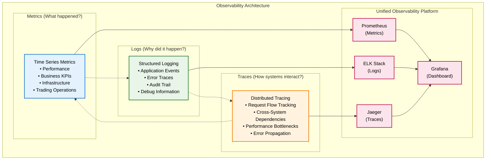

# Monitoring & Observability Architecture

Comprehensive monitoring, observability, and alerting framework for pysystemtrade's production trading environment.

## Executive Summary

The monitoring and observability architecture for pysystemtrade implements a **comprehensive observability strategy** that provides deep insights into system performance, trading operations, and business metrics. The framework enables proactive issue detection, root cause analysis, and performance optimization through structured telemetry, logging, and alerting.

### **Observability Vision**
*"A comprehensive observability platform that provides real-time insights into system health, trading performance, and business outcomes, enabling proactive decision-making and rapid incident resolution through unified monitoring, logging, and alerting capabilities."*

## Observability Framework Overview

### **Three Pillars of Observability**



## Metrics & Performance Monitoring

### **Multi-Dimensional Metrics Framework**

#### **Metric Categories & Hierarchies**
```python
class MetricsFramework:
    """
    Comprehensive metrics collection and organization
    """
    METRIC_CATEGORIES = {
        'infrastructure': {
            'cpu': ['usage_percent', 'load_average', 'context_switches'],
            'memory': ['usage_percent', 'available_bytes', 'swap_usage'],
            'disk': ['usage_percent', 'io_operations', 'throughput_bytes'],
            'network': ['bandwidth_utilization', 'packet_loss', 'latency_ms']
        },
        'application': {
            'performance': ['response_time_ms', 'throughput_rps', 'error_rate'],
            'resources': ['connection_pool_usage', 'thread_pool_usage', 'gc_time'],
            'business_logic': ['orders_per_second', 'positions_updated', 'calculations_completed']
        },
        'trading': {
            'execution': ['order_fill_rate', 'slippage_bps', 'execution_latency_ms'],
            'risk': ['var_utilization', 'position_concentration', 'leverage_ratio'],
            'performance': ['realized_pnl', 'unrealized_pnl', 'sharpe_ratio', 'max_drawdown']
        },
        'data': {
            'quality': ['completeness_percent', 'accuracy_score', 'timeliness_ms'],
            'pipeline': ['records_processed', 'processing_latency', 'error_count'],
            'storage': ['query_performance', 'index_efficiency', 'cache_hit_rate']
        }
    }
    
    def __init__(self):
        self.metric_collectors = {
            'prometheus': PrometheusCollector(),
            'custom': CustomMetricsCollector(),
            'business': BusinessMetricsCollector()
        }
        
    def collect_metrics(self, category: str, subcategory: str) -> MetricCollection:
        """
        Collect metrics for specific category and subcategory
        """
        metrics = self.METRIC_CATEGORIES[category][subcategory]
        
        collected_metrics = MetricCollection(
            category=category,
            subcategory=subcategory,
            timestamp=datetime.utcnow()
        )
        
        for metric_name in metrics:
            value = self._collect_metric_value(category, subcategory, metric_name)
            collected_metrics.add_metric(metric_name, value)
            
        return collected_metrics
```

#### **Trading Performance Metrics**
```python
class TradingMetricsCollector:
    """
    Specialized metrics collection for trading operations
    """
    def __init__(self):
        self.performance_calculator = PerformanceCalculator()
        self.risk_calculator = RiskCalculator()
        
    def collect_trading_metrics(self) -> TradingMetrics:
        """
        Comprehensive trading performance metrics collection
        """
        current_time = datetime.utcnow()
        
        # Performance Metrics
        performance_metrics = {
            'realized_pnl': self._get_realized_pnl(),
            'unrealized_pnl': self._get_unrealized_pnl(),
            'total_return': self._get_total_return(),
            'sharpe_ratio': self.performance_calculator.calculate_sharpe_ratio(),
            'sortino_ratio': self.performance_calculator.calculate_sortino_ratio(),
            'max_drawdown': self.performance_calculator.calculate_max_drawdown(),
            'calmar_ratio': self.performance_calculator.calculate_calmar_ratio()
        }
        
        # Risk Metrics
        risk_metrics = {
            'var_95': self.risk_calculator.calculate_var(confidence=0.95),
            'var_99': self.risk_calculator.calculate_var(confidence=0.99),
            'expected_shortfall': self.risk_calculator.calculate_expected_shortfall(),
            'beta': self.risk_calculator.calculate_beta(),
            'tracking_error': self.risk_calculator.calculate_tracking_error()
        }
        
        # Execution Metrics
        execution_metrics = {
            'orders_placed': self._count_orders_placed(),
            'orders_filled': self._count_orders_filled(),
            'fill_rate': self._calculate_fill_rate(),
            'average_slippage': self._calculate_average_slippage(),
            'execution_latency': self._calculate_execution_latency()
        }
        
        # Position Metrics
        position_metrics = {
            'total_positions': self._count_active_positions(),
            'long_positions': self._count_long_positions(),
            'short_positions': self._count_short_positions(),
            'position_concentration': self._calculate_position_concentration(),
            'leverage_ratio': self._calculate_leverage_ratio()
        }
        
        return TradingMetrics(
            timestamp=current_time,
            performance=performance_metrics,
            risk=risk_metrics,
            execution=execution_metrics,
            positions=position_metrics
        )
```

### **Custom Business Metrics**

#### **Business KPI Framework**
```python
class BusinessMetricsFramework:
    """
    Business-specific metrics and KPIs for trading operations
    """
    def __init__(self):
        self.kpi_definitions = {
            'strategy_performance': {
                'profit_factor': 'gross_profit / gross_loss',
                'win_rate': 'winning_trades / total_trades',
                'average_win': 'total_profit / winning_trades',
                'average_loss': 'total_loss / losing_trades',
                'expectancy': '(win_rate * average_win) - (loss_rate * average_loss)'
            },
            'operational_efficiency': {
                'system_uptime': 'operational_hours / total_hours',
                'data_freshness': 'current_time - latest_data_timestamp',
                'processing_throughput': 'records_processed / processing_time',
                'error_rate': 'error_count / total_operations'
            },
            'risk_management': {
                'risk_adjusted_return': 'total_return / max_drawdown',
                'correlation_exposure': 'sum(position_correlations)',
                'sector_concentration': 'max_sector_weight / total_portfolio',
                'leverage_utilization': 'current_leverage / max_allowed_leverage'
            }
        }
        
    def calculate_kpi(self, category: str, kpi_name: str) -> float:
        """
        Calculate specific KPI based on current data
        """
        formula = self.kpi_definitions[category][kpi_name]
        
        # Parse formula and extract required data
        required_data = self._extract_data_requirements(formula)
        
        # Collect required data
        data_values = {}
        for data_point in required_data:
            data_values[data_point] = self._get_data_value(data_point)
            
        # Calculate KPI using formula
        kpi_value = self._evaluate_formula(formula, data_values)
        
        return kpi_value
```

## Logging & Event Management

### **Structured Logging Architecture**

#### **Logging Framework Design**
```python
class StructuredLoggingFramework:
    """
    Comprehensive structured logging with context preservation
    """
    def __init__(self):
        self.log_formatters = {
            'json': JSONLogFormatter(),
            'elk': ELKLogFormatter(),
            'human_readable': HumanReadableFormatter()
        }
        
        self.log_destinations = {
            'local_file': FileLogHandler(),
            'elasticsearch': ElasticsearchHandler(),
            'syslog': SyslogHandler(),
            'cloudwatch': CloudWatchHandler()
        }
        
        self.context_manager = LoggingContextManager()
        
    def create_logger(self, component: str, level: str = 'INFO') -> StructuredLogger:
        """
        Create component-specific structured logger
        """
        logger_config = LoggerConfiguration(
            component=component,
            level=level,
            formatters=self.log_formatters,
            handlers=self._get_component_handlers(component),
            context_enrichment=True
        )
        
        return StructuredLogger(logger_config, self.context_manager)
        
class StructuredLogger:
    """
    Context-aware structured logger with automatic enrichment
    """
    def __init__(self, config: LoggerConfiguration, context_manager: LoggingContextManager):
        self.config = config
        self.context_manager = context_manager
        
    def info(self, message: str, **kwargs):
        """
        Log info message with automatic context enrichment
        """
        log_entry = self._create_log_entry('INFO', message, **kwargs)
        enriched_entry = self.context_manager.enrich_log_entry(log_entry)
        self._write_log_entry(enriched_entry)
        
    def error(self, message: str, exception: Exception = None, **kwargs):
        """
        Log error message with exception details and stack trace
        """
        log_entry = self._create_log_entry('ERROR', message, **kwargs)
        
        if exception:
            log_entry.exception = {
                'type': type(exception).__name__,
                'message': str(exception),
                'stack_trace': traceback.format_exc()
            }
            
        enriched_entry = self.context_manager.enrich_log_entry(log_entry)
        self._write_log_entry(enriched_entry)
        
        # Trigger alerting for error conditions
        self._trigger_error_alert(enriched_entry)
        
    def _create_log_entry(self, level: str, message: str, **kwargs) -> LogEntry:
        """
        Create structured log entry with standard fields
        """
        return LogEntry(
            timestamp=datetime.utcnow(),
            level=level,
            component=self.config.component,
            message=message,
            correlation_id=self.context_manager.get_correlation_id(),
            thread_id=threading.current_thread().ident,
            process_id=os.getpid(),
            custom_fields=kwargs
        )
```

#### **Trading Event Logging**
```python
class TradingEventLogger:
    """
    Specialized logging for trading operations and events
    """
    def __init__(self):
        self.logger = StructuredLoggingFramework().create_logger('trading')
        self.audit_logger = StructuredLoggingFramework().create_logger('audit')
        
    def log_order_event(self, order_event: OrderEvent):
        """
        Log order-related events with full context
        """
        self.logger.info(
            "Order event occurred",
            event_type=order_event.event_type,
            order_id=order_event.order_id,
            instrument_code=order_event.instrument_code,
            quantity=order_event.quantity,
            price=order_event.price,
            strategy_name=order_event.strategy_name,
            timestamp=order_event.timestamp,
            execution_latency=order_event.execution_latency,
            slippage=order_event.slippage
        )
        
        # Additional audit logging for compliance
        self.audit_logger.info(
            "Trading action recorded",
            action="order_event",
            user_id=order_event.user_id,
            order_details=order_event.to_dict(),
            compliance_flags=self._check_compliance_flags(order_event)
        )
        
    def log_position_change(self, position_change: PositionChange):
        """
        Log position changes with risk impact analysis
        """
        self.logger.info(
            "Position change recorded",
            instrument_code=position_change.instrument_code,
            old_position=position_change.old_position,
            new_position=position_change.new_position,
            change=position_change.change,
            strategy_name=position_change.strategy_name,
            risk_impact=self._calculate_risk_impact(position_change)
        )
        
    def log_pnl_update(self, pnl_update: PnLUpdate):
        """
        Log P&L updates with performance attribution
        """
        self.logger.info(
            "P&L update recorded",
            strategy_name=pnl_update.strategy_name,
            realized_pnl=pnl_update.realized_pnl,
            unrealized_pnl=pnl_update.unrealized_pnl,
            total_pnl=pnl_update.total_pnl,
            attribution=pnl_update.attribution,
            benchmark_performance=pnl_update.benchmark_performance
        )
```

### **Log Analysis & Pattern Detection**

#### **Log Analysis Engine**
```python
class LogAnalysisEngine:
    """
    Real-time log analysis and pattern detection
    """
    def __init__(self):
        self.pattern_detectors = {
            'error_clustering': ErrorClusteringDetector(),
            'performance_anomaly': PerformanceAnomalyDetector(),
            'security_events': SecurityEventDetector(),
            'business_anomaly': BusinessAnomalyDetector()
        }
        
        self.ml_models = {
            'anomaly_detection': LogAnomalyModel(),
            'classification': LogClassificationModel(),
            'clustering': LogClusteringModel()
        }
        
    def analyze_log_stream(self, log_stream: Iterator[LogEntry]) -> AnalysisResults:
        """
        Real-time analysis of log stream for patterns and anomalies
        """
        analysis_results = AnalysisResults()
        
        for log_entry in log_stream:
            # Pattern detection
            for detector_name, detector in self.pattern_detectors.items():
                patterns = detector.detect_patterns(log_entry)
                if patterns:
                    analysis_results.add_pattern_detection(detector_name, patterns)
                    
            # ML-based analysis
            anomaly_score = self.ml_models['anomaly_detection'].predict(log_entry)
            if anomaly_score > 0.8:  # High anomaly threshold
                analysis_results.add_anomaly(log_entry, anomaly_score)
                
            # Classification
            log_category = self.ml_models['classification'].classify(log_entry)
            analysis_results.add_classification(log_entry, log_category)
            
        return analysis_results
        
    def generate_insights(self, analysis_results: AnalysisResults) -> List[Insight]:
        """
        Generate actionable insights from log analysis
        """
        insights = []
        
        # Error pattern insights
        error_patterns = analysis_results.get_error_patterns()
        if error_patterns:
            insight = self._analyze_error_patterns(error_patterns)
            insights.append(insight)
            
        # Performance insights
        performance_anomalies = analysis_results.get_performance_anomalies()
        if performance_anomalies:
            insight = self._analyze_performance_anomalies(performance_anomalies)
            insights.append(insight)
            
        # Business insights
        business_patterns = analysis_results.get_business_patterns()
        if business_patterns:
            insight = self._analyze_business_patterns(business_patterns)
            insights.append(insight)
            
        return insights
```

## Distributed Tracing

### **Request Tracing Architecture**

#### **Tracing Implementation**
```python
class DistributedTracingManager:
    """
    Comprehensive distributed tracing for complex trading workflows
    """
    def __init__(self):
        self.tracer = self._initialize_jaeger_tracer()
        self.span_processors = [
            BatchSpanProcessor(),
            SamplingProcessor(sample_rate=0.1),
            EnrichmentProcessor()
        ]
        
    def trace_trading_workflow(self, workflow_name: str):
        """
        Decorator to trace complete trading workflows
        """
        def decorator(func):
            @wraps(func)
            def wrapper(*args, **kwargs):
                with self.tracer.start_as_current_span(
                    workflow_name,
                    kind=SpanKind.SERVER
                ) as span:
                    # Add workflow context
                    span.set_attributes({
                        'workflow.name': workflow_name,
                        'workflow.start_time': datetime.utcnow().isoformat(),
                        'component': 'trading_engine'
                    })
                    
                    try:
                        result = func(*args, **kwargs)
                        
                        # Add success attributes
                        span.set_attribute('workflow.status', 'success')
                        if hasattr(result, 'metrics'):
                            span.set_attributes(result.metrics)
                            
                        return result
                        
                    except Exception as e:
                        # Add error attributes
                        span.set_status(StatusCode.ERROR, str(e))
                        span.set_attributes({
                            'workflow.status': 'error',
                            'error.type': type(e).__name__,
                            'error.message': str(e)
                        })
                        raise
                        
            return wrapper
        return decorator
        
    def trace_external_call(self, service_name: str, operation: str):
        """
        Trace external service calls (broker, data provider, etc.)
        """
        def decorator(func):
            @wraps(func)
            def wrapper(*args, **kwargs):
                with self.tracer.start_as_current_span(
                    f"{service_name}.{operation}",
                    kind=SpanKind.CLIENT
                ) as span:
                    span.set_attributes({
                        'service.name': service_name,
                        'service.operation': operation,
                        'call.start_time': datetime.utcnow().isoformat()
                    })
                    
                    start_time = time.time()
                    try:
                        result = func(*args, **kwargs)
                        
                        duration = time.time() - start_time
                        span.set_attributes({
                            'call.duration_ms': duration * 1000,
                            'call.status': 'success'
                        })
                        
                        return result
                        
                    except Exception as e:
                        duration = time.time() - start_time
                        span.set_attributes({
                            'call.duration_ms': duration * 1000,
                            'call.status': 'error',
                            'error.type': type(e).__name__
                        })
                        span.record_exception(e)
                        raise
                        
            return wrapper
        return decorator
```

#### **Trading Flow Tracing**
```python
class TradingFlowTracer:
    """
    Specialized tracing for trading operations and workflows
    """
    def __init__(self):
        self.tracing_manager = DistributedTracingManager()
        
    @DistributedTracingManager().trace_trading_workflow("order_execution_flow")
    def trace_order_execution(self, order_request: OrderRequest) -> OrderResult:
        """
        Trace complete order execution workflow
        """
        with self.tracing_manager.tracer.start_as_current_span("validate_order") as span:
            validation_result = self._validate_order(order_request)
            span.set_attributes(validation_result.to_dict())
            
        with self.tracing_manager.tracer.start_as_current_span("risk_check") as span:
            risk_result = self._perform_risk_check(order_request)
            span.set_attributes(risk_result.to_dict())
            
        with self.tracing_manager.tracer.start_as_current_span("broker_submission") as span:
            broker_result = self._submit_to_broker(order_request)
            span.set_attributes(broker_result.to_dict())
            
        with self.tracing_manager.tracer.start_as_current_span("position_update") as span:
            position_result = self._update_positions(order_request, broker_result)
            span.set_attributes(position_result.to_dict())
            
        return OrderResult(
            validation=validation_result,
            risk_check=risk_result,
            broker_submission=broker_result,
            position_update=position_result
        )
        
    def create_trading_trace_context(self, strategy_name: str, 
                                   instrument_code: str) -> TraceContext:
        """
        Create trading-specific trace context
        """
        return TraceContext(
            trace_id=str(uuid.uuid4()),
            span_id=str(uuid.uuid4()),
            strategy_name=strategy_name,
            instrument_code=instrument_code,
            timestamp=datetime.utcnow(),
            correlation_attributes={
                'trading.strategy': strategy_name,
                'trading.instrument': instrument_code,
                'trading.session': self._get_trading_session_id()
            }
        )
```

## Alerting & Notification System

### **Multi-Channel Alerting Framework**

#### **Alert Management System**
```python
class AlertingFramework:
    """
    Comprehensive alerting system with multiple channels and escalation
    """
    def __init__(self):
        self.alert_channels = {
            'email': EmailAlertChannel(),
            'slack': SlackAlertChannel(),
            'pagerduty': PagerDutyAlertChannel(),
            'sms': SMSAlertChannel(),
            'webhook': WebhookAlertChannel()
        }
        
        self.escalation_policies = {
            'critical': EscalationPolicy([
                {'channel': 'pagerduty', 'delay': 0},
                {'channel': 'sms', 'delay': 300},  # 5 minutes
                {'channel': 'email', 'delay': 600}  # 10 minutes
            ]),
            'high': EscalationPolicy([
                {'channel': 'slack', 'delay': 0},
                {'channel': 'email', 'delay': 900}  # 15 minutes
            ]),
            'medium': EscalationPolicy([
                {'channel': 'email', 'delay': 0}
            ]),
            'low': EscalationPolicy([
                {'channel': 'email', 'delay': 3600}  # 1 hour
            ])
        }
        
    def create_alert(self, alert_type: str, severity: str, 
                    message: str, **context) -> Alert:
        """
        Create and process alert through appropriate channels
        """
        alert = Alert(
            alert_id=str(uuid.uuid4()),
            alert_type=alert_type,
            severity=severity,
            message=message,
            timestamp=datetime.utcnow(),
            context=context,
            status='created'
        )
        
        # Determine escalation policy
        escalation_policy = self.escalation_policies.get(severity, 
                                                       self.escalation_policies['medium'])
        
        # Process alert through escalation policy
        self._process_alert_escalation(alert, escalation_policy)
        
        return alert
        
    def _process_alert_escalation(self, alert: Alert, 
                                escalation_policy: EscalationPolicy):
        """
        Process alert through escalation policy
        """
        for step in escalation_policy.steps:
            channel_name = step['channel']
            delay = step['delay']
            
            if delay > 0:
                # Schedule delayed alert
                self._schedule_delayed_alert(alert, channel_name, delay)
            else:
                # Send immediate alert
                channel = self.alert_channels[channel_name]
                channel.send_alert(alert)
```

#### **Trading-Specific Alerts**
```python
class TradingAlertManager:
    """
    Specialized alert management for trading operations
    """
    def __init__(self):
        self.alerting_framework = AlertingFramework()
        self.alert_rules = {
            'position_limit_breach': {
                'severity': 'critical',
                'channels': ['pagerduty', 'sms'],
                'auto_actions': ['halt_strategy', 'notify_risk_manager']
            },
            'large_drawdown': {
                'severity': 'high',
                'channels': ['slack', 'email'],
                'threshold': 0.05,  # 5% drawdown
                'auto_actions': ['reduce_positions']
            },
            'execution_latency_high': {
                'severity': 'medium',
                'channels': ['email'],
                'threshold': 1000,  # 1 second
                'auto_actions': ['investigate_connectivity']
            },
            'data_quality_issue': {
                'severity': 'high',
                'channels': ['slack', 'email'],
                'auto_actions': ['pause_strategies', 'validate_data_sources']
            }
        }
        
    def check_trading_conditions(self) -> List[Alert]:
        """
        Check trading conditions and generate alerts as needed
        """
        alerts = []
        
        # Position limit checks
        position_alerts = self._check_position_limits()
        alerts.extend(position_alerts)
        
        # Performance checks
        performance_alerts = self._check_performance_conditions()
        alerts.extend(performance_alerts)
        
        # Execution quality checks
        execution_alerts = self._check_execution_quality()
        alerts.extend(execution_alerts)
        
        # Data quality checks
        data_alerts = self._check_data_quality()
        alerts.extend(data_alerts)
        
        return alerts
        
    def _check_position_limits(self) -> List[Alert]:
        """
        Check position limits and generate alerts for breaches
        """
        alerts = []
        
        current_positions = self._get_current_positions()
        position_limits = self._get_position_limits()
        
        for instrument, position in current_positions.items():
            limit = position_limits.get(instrument)
            if limit and abs(position) > limit:
                alert = self.alerting_framework.create_alert(
                    alert_type='position_limit_breach',
                    severity='critical',
                    message=f'Position limit breach for {instrument}',
                    instrument=instrument,
                    current_position=position,
                    limit=limit,
                    breach_amount=abs(position) - limit
                )
                alerts.append(alert)
                
        return alerts
```

### **Dashboard & Visualization**

#### **Real-Time Dashboard Framework**
```python
class MonitoringDashboard:
    """
    Comprehensive real-time monitoring dashboard
    """
    def __init__(self):
        self.dashboard_config = {
            'trading_overview': {
                'widgets': [
                    {'type': 'pnl_chart', 'position': (0, 0, 2, 1)},
                    {'type': 'positions_table', 'position': (2, 0, 2, 1)},
                    {'type': 'orders_feed', 'position': (0, 1, 4, 1)},
                    {'type': 'risk_metrics', 'position': (0, 2, 2, 1)},
                    {'type': 'system_health', 'position': (2, 2, 2, 1)}
                ],
                'refresh_interval': 1000  # 1 second
            },
            'system_performance': {
                'widgets': [
                    {'type': 'cpu_usage', 'position': (0, 0, 1, 1)},
                    {'type': 'memory_usage', 'position': (1, 0, 1, 1)},
                    {'type': 'network_io', 'position': (2, 0, 1, 1)},
                    {'type': 'disk_io', 'position': (3, 0, 1, 1)},
                    {'type': 'application_metrics', 'position': (0, 1, 4, 1)}
                ],
                'refresh_interval': 5000  # 5 seconds
            },
            'data_quality': {
                'widgets': [
                    {'type': 'data_freshness', 'position': (0, 0, 2, 1)},
                    {'type': 'data_completeness', 'position': (2, 0, 2, 1)},
                    {'type': 'data_accuracy', 'position': (0, 1, 2, 1)},
                    {'type': 'pipeline_health', 'position': (2, 1, 2, 1)}
                ],
                'refresh_interval': 10000  # 10 seconds
            }
        }
        
    def generate_dashboard_data(self, dashboard_type: str) -> DashboardData:
        """
        Generate data for specific dashboard type
        """
        config = self.dashboard_config[dashboard_type]
        
        dashboard_data = DashboardData(
            dashboard_type=dashboard_type,
            timestamp=datetime.utcnow(),
            widgets=[]
        )
        
        for widget_config in config['widgets']:
            widget_data = self._generate_widget_data(widget_config)
            dashboard_data.add_widget(widget_data)
            
        return dashboard_data
        
    def _generate_widget_data(self, widget_config: dict) -> WidgetData:
        """
        Generate data for specific widget type
        """
        widget_type = widget_config['type']
        
        if widget_type == 'pnl_chart':
            return self._generate_pnl_chart_data()
        elif widget_type == 'positions_table':
            return self._generate_positions_table_data()
        elif widget_type == 'risk_metrics':
            return self._generate_risk_metrics_data()
        # ... additional widget types
        
        return WidgetData(widget_type, {})
```

## Performance Analytics & Optimization

### **Performance Analysis Framework**

#### **System Performance Analytics**
```python
class PerformanceAnalytics:
    """
    Comprehensive performance analysis and optimization recommendations
    """
    def __init__(self):
        self.performance_collectors = {
            'system': SystemPerformanceCollector(),
            'application': ApplicationPerformanceCollector(),
            'database': DatabasePerformanceCollector(),
            'network': NetworkPerformanceCollector()
        }
        
        self.analyzers = {
            'bottleneck': BottleneckAnalyzer(),
            'trend': TrendAnalyzer(),
            'correlation': CorrelationAnalyzer(),
            'capacity': CapacityAnalyzer()
        }
        
    def perform_comprehensive_analysis(self) -> PerformanceAnalysisReport:
        """
        Perform comprehensive performance analysis across all components
        """
        report = PerformanceAnalysisReport()
        
        # Collect performance data
        performance_data = {}
        for collector_name, collector in self.performance_collectors.items():
            performance_data[collector_name] = collector.collect_performance_data()
            
        # Analyze performance data
        for analyzer_name, analyzer in self.analyzers.items():
            analysis_result = analyzer.analyze(performance_data)
            report.add_analysis(analyzer_name, analysis_result)
            
        # Generate optimization recommendations
        recommendations = self._generate_optimization_recommendations(report)
        report.set_recommendations(recommendations)
        
        return report
        
    def _generate_optimization_recommendations(self, 
                                            analysis_report: PerformanceAnalysisReport) -> List[OptimizationRecommendation]:
        """
        Generate actionable optimization recommendations
        """
        recommendations = []
        
        # CPU optimization recommendations
        cpu_analysis = analysis_report.get_analysis('bottleneck').cpu_analysis
        if cpu_analysis.utilization > 80:
            recommendations.append(OptimizationRecommendation(
                category='cpu',
                priority='high',
                description='CPU utilization consistently above 80%',
                recommendations=[
                    'Consider vertical scaling (more CPU cores)',
                    'Profile application for CPU-intensive operations',
                    'Implement CPU-bound task queuing',
                    'Optimize algorithmic complexity in hot paths'
                ]
            ))
            
        # Memory optimization recommendations
        memory_analysis = analysis_report.get_analysis('bottleneck').memory_analysis
        if memory_analysis.utilization > 90:
            recommendations.append(OptimizationRecommendation(
                category='memory',
                priority='critical',
                description='Memory utilization above 90%',
                recommendations=[
                    'Immediate memory increase required',
                    'Implement memory profiling and leak detection',
                    'Optimize data structures and caching',
                    'Consider data pagination for large datasets'
                ]
            ))
            
        return recommendations
```

---

**Next:** [Scalability & Performance Architecture](08-scalability-performance.md) - System scaling strategies and performance optimization patterns