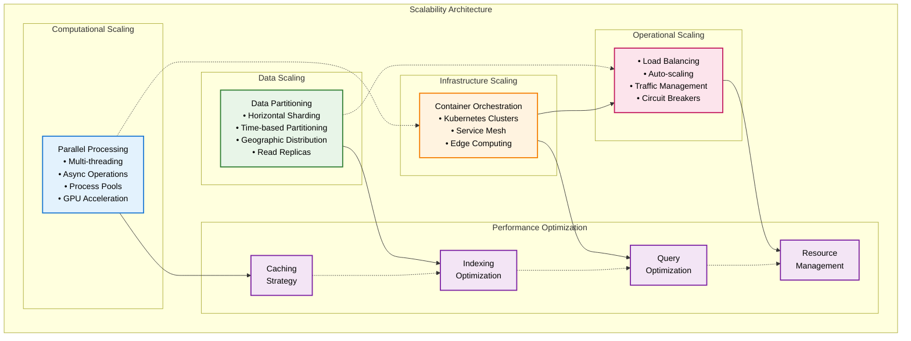

# Scalability & Performance Architecture

Comprehensive system scaling strategies and performance optimization patterns for pysystemtrade's enterprise trading platform.

## Executive Summary

The scalability and performance architecture for pysystemtrade implements a **multi-dimensional scaling strategy** that addresses computational, data, and operational scaling challenges inherent in systematic trading. The framework provides horizontal and vertical scaling capabilities while maintaining low-latency execution and high-availability requirements.

### **Scalability Vision**
*"A highly scalable and performant trading platform that can accommodate growing data volumes, increasing computational complexity, and expanding trading strategies while maintaining sub-millisecond execution latencies and 99.99% system availability."*

## Scalability Framework Overview

### **Multi-Dimensional Scaling Strategy**



## Performance Optimization Framework

### **Computational Performance**

#### **Parallel Processing Architecture**
```python
class ComputationalScalingManager:
    """
    Multi-level parallelization for trading computations
    """
    def __init__(self):
        self.execution_strategies = {
            'cpu_bound': CPUBoundExecutionStrategy(),
            'io_bound': IOBoundExecutionStrategy(),
            'memory_bound': MemoryBoundExecutionStrategy(),
            'mixed_workload': MixedWorkloadExecutionStrategy()
        }
        
        self.resource_managers = {
            'thread_pool': ThreadPoolManager(max_workers=32),
            'process_pool': ProcessPoolManager(max_workers=8),
            'async_pool': AsyncIOManager(),
            'gpu_pool': GPUComputeManager()
        }
        
    def optimize_computation(self, computation_task: ComputationTask) -> OptimizedExecution:
        """
        Optimize computation based on workload characteristics
        """
        # Analyze workload characteristics
        workload_profile = self._analyze_workload(computation_task)
        
        # Select optimal execution strategy
        execution_strategy = self.execution_strategies[workload_profile.type]
        
        # Configure resource allocation
        resource_config = self._determine_resource_allocation(
            computation_task, workload_profile
        )
        
        # Execute with optimization
        optimized_execution = execution_strategy.execute(
            computation_task, resource_config
        )
        
        return optimized_execution
        
class ParallelProcessingFramework:
    """
    Framework for parallel execution of trading operations
    """
    def __init__(self):
        self.parallel_strategies = {
            'portfolio_calculation': PortfolioParallelStrategy(),
            'risk_calculation': RiskParallelStrategy(),
            'analytics_computation': AnalyticsParallelStrategy(),
            'backtesting': BacktestingParallelStrategy()
        }
        
    def parallelize_portfolio_calculation(self, instruments: List[str], 
                                        strategies: List[str]) -> ParallelResult:
        """
        Parallelize portfolio calculations across instruments and strategies
        """
        with concurrent.futures.ThreadPoolExecutor(max_workers=16) as executor:
            # Create computation tasks
            computation_tasks = []
            
            for instrument in instruments:
                for strategy in strategies:
                    task = PortfolioComputationTask(
                        instrument=instrument,
                        strategy=strategy,
                        calculation_date=datetime.utcnow()
                    )
                    computation_tasks.append(task)
            
            # Submit tasks for parallel execution
            future_to_task = {
                executor.submit(self._calculate_portfolio_component, task): task
                for task in computation_tasks
            }
            
            # Collect results
            results = {}
            for future in concurrent.futures.as_completed(future_to_task):
                task = future_to_task[future]
                try:
                    result = future.result()
                    results[f"{task.instrument}_{task.strategy}"] = result
                except Exception as e:
                    self._handle_computation_error(task, e)
                    
            return ParallelResult(results)
```

#### **Asynchronous Operations Framework**
```python
class AsyncOperationsManager:
    """
    High-performance asynchronous operations for I/O bound tasks
    """
    def __init__(self):
        self.async_pools = {
            'data_fetch': asyncio.BoundedSemaphore(50),
            'broker_operations': asyncio.BoundedSemaphore(10),
            'database_operations': asyncio.BoundedSemaphore(25),
            'analytics_updates': asyncio.BoundedSemaphore(20)
        }
        
    async def fetch_market_data_async(self, instruments: List[str]) -> Dict[str, MarketData]:
        """
        Asynchronously fetch market data for multiple instruments
        """
        async with self.async_pools['data_fetch']:
            tasks = []
            
            for instrument in instruments:
                task = self._create_data_fetch_task(instrument)
                tasks.append(task)
                
            # Execute all tasks concurrently
            results = await asyncio.gather(*tasks, return_exceptions=True)
            
            # Process results
            market_data = {}
            for instrument, result in zip(instruments, results):
                if isinstance(result, Exception):
                    self._handle_fetch_error(instrument, result)
                else:
                    market_data[instrument] = result
                    
            return market_data
            
    async def execute_orders_async(self, orders: List[OrderRequest]) -> List[OrderResult]:
        """
        Asynchronously execute multiple orders
        """
        async with self.async_pools['broker_operations']:
            # Group orders by broker for optimization
            orders_by_broker = self._group_orders_by_broker(orders)
            
            broker_tasks = []
            for broker, broker_orders in orders_by_broker.items():
                task = self._create_broker_execution_task(broker, broker_orders)
                broker_tasks.append(task)
                
            # Execute broker tasks concurrently
            broker_results = await asyncio.gather(*broker_tasks)
            
            # Flatten results
            all_results = []
            for broker_result in broker_results:
                all_results.extend(broker_result.order_results)
                
            return all_results
```

### **Memory Management & Optimization**

#### **Memory-Efficient Data Structures**
```python
class MemoryOptimizedDataStructures:
    """
    Memory-efficient data structures for large-scale trading operations
    """
    def __init__(self):
        self.data_compressors = {
            'price_data': PriceDataCompressor(),
            'position_data': PositionDataCompressor(),
            'analytics_data': AnalyticsDataCompressor()
        }
        
        self.memory_pools = {
            'small_objects': MemoryPool(object_size=1024, pool_size=10000),
            'medium_objects': MemoryPool(object_size=8192, pool_size=5000),
            'large_objects': MemoryPool(object_size=65536, pool_size=1000)
        }
        
    def create_compressed_time_series(self, data: pd.DataFrame, 
                                    compression_level: str = 'standard') -> CompressedTimeSeries:
        """
        Create memory-efficient compressed time series
        """
        # Analyze data characteristics
        data_profile = self._analyze_data_characteristics(data)
        
        # Select optimal compression strategy
        compressor = self._select_compression_strategy(data_profile, compression_level)
        
        # Apply compression
        compressed_data = compressor.compress(data)
        
        # Create compressed time series wrapper
        compressed_ts = CompressedTimeSeries(
            data=compressed_data,
            compression_metadata=compressor.get_metadata(),
            original_shape=data.shape,
            memory_savings=self._calculate_memory_savings(data, compressed_data)
        )
        
        return compressed_ts
        
class CacheOptimizationManager:
    """
    Multi-level cache optimization for performance
    """
    def __init__(self):
        self.cache_levels = {
            'L1': CPUCacheOptimizer(),
            'L2': MemoryCacheOptimizer(), 
            'L3': DiskCacheOptimizer(),
            'L4': NetworkCacheOptimizer()
        }
        
        self.cache_policies = {
            'lru': LRUCachePolicy(),
            'lfu': LFUCachePolicy(),
            'adaptive': AdaptiveCachePolicy(),
            'time_based': TimeBasedCachePolicy()
        }
        
    def optimize_data_access_patterns(self, access_patterns: List[AccessPattern]) -> CacheConfiguration:
        """
        Optimize cache configuration based on data access patterns
        """
        # Analyze access patterns
        pattern_analysis = self._analyze_access_patterns(access_patterns)
        
        # Determine optimal cache configuration
        cache_config = CacheConfiguration()
        
        for cache_level, optimizer in self.cache_levels.items():
            level_config = optimizer.optimize_for_patterns(pattern_analysis)
            cache_config.set_level_configuration(cache_level, level_config)
            
        # Select cache policy
        optimal_policy = self._select_cache_policy(pattern_analysis)
        cache_config.set_cache_policy(optimal_policy)
        
        return cache_config
```

## Horizontal Scaling Architecture

### **Microservices Scaling Strategy**

#### **Service Decomposition Framework**
```python
class MicroservicesScalingManager:
    """
    Manage horizontal scaling of trading microservices
    """
    def __init__(self):
        self.service_registry = {
            'portfolio_service': {
                'min_instances': 2,
                'max_instances': 20,
                'scaling_metric': 'cpu_utilization',
                'scaling_threshold': 70,
                'dependencies': ['data_service', 'risk_service']
            },
            'trading_service': {
                'min_instances': 3,
                'max_instances': 15,
                'scaling_metric': 'order_queue_length',
                'scaling_threshold': 100,
                'dependencies': ['broker_service', 'risk_service']
            },
            'analytics_service': {
                'min_instances': 1,
                'max_instances': 10,
                'scaling_metric': 'computation_queue_length',
                'scaling_threshold': 50,
                'dependencies': ['data_service']
            },
            'risk_service': {
                'min_instances': 2,
                'max_instances': 8,
                'scaling_metric': 'risk_calculation_latency',
                'scaling_threshold': 500,  # 500ms
                'dependencies': ['data_service']
            }
        }
        
    def auto_scale_services(self) -> ScalingDecisions:
        """
        Make automatic scaling decisions based on service metrics
        """
        scaling_decisions = ScalingDecisions()
        
        for service_name, config in self.service_registry.items():
            # Get current service metrics
            current_metrics = self._get_service_metrics(service_name)
            
            # Determine scaling decision
            scaling_decision = self._make_scaling_decision(
                service_name, config, current_metrics
            )
            
            if scaling_decision.action != 'no_change':
                scaling_decisions.add_decision(service_name, scaling_decision)
                
        return scaling_decisions
        
    def _make_scaling_decision(self, service_name: str, config: dict, 
                             metrics: ServiceMetrics) -> ScalingDecision:
        """
        Make scaling decision for specific service
        """
        current_instances = metrics.instance_count
        scaling_metric_value = getattr(metrics, config['scaling_metric'])
        threshold = config['scaling_threshold']
        
        # Scale up decision
        if scaling_metric_value > threshold and current_instances < config['max_instances']:
            target_instances = min(
                current_instances + self._calculate_scale_up_amount(scaling_metric_value, threshold),
                config['max_instances']
            )
            
            return ScalingDecision(
                action='scale_up',
                current_instances=current_instances,
                target_instances=target_instances,
                reason=f"{config['scaling_metric']} ({scaling_metric_value}) exceeded threshold ({threshold})"
            )
            
        # Scale down decision
        elif scaling_metric_value < threshold * 0.5 and current_instances > config['min_instances']:
            target_instances = max(
                current_instances - 1,
                config['min_instances']
            )
            
            return ScalingDecision(
                action='scale_down',
                current_instances=current_instances,
                target_instances=target_instances,
                reason=f"{config['scaling_metric']} ({scaling_metric_value}) well below threshold"
            )
            
        return ScalingDecision(action='no_change')
```

#### **Load Balancing & Distribution**
```python
class IntelligentLoadBalancer:
    """
    Intelligent load balancing for trading services
    """
    def __init__(self):
        self.load_balancing_strategies = {
            'round_robin': RoundRobinStrategy(),
            'weighted_round_robin': WeightedRoundRobinStrategy(),
            'least_connections': LeastConnectionsStrategy(),
            'least_response_time': LeastResponseTimeStrategy(),
            'resource_based': ResourceBasedStrategy(),
            'geographic': GeographicStrategy()
        }
        
        self.service_health_monitor = ServiceHealthMonitor()
        
    def route_request(self, request: ServiceRequest) -> ServiceEndpoint:
        """
        Intelligently route request to optimal service instance
        """
        # Get available service instances
        available_instances = self._get_healthy_instances(request.service_name)
        
        if not available_instances:
            raise ServiceUnavailableError(f"No healthy instances for {request.service_name}")
            
        # Select load balancing strategy based on request type
        strategy = self._select_strategy(request)
        
        # Route request
        selected_instance = strategy.select_instance(available_instances, request)
        
        # Update load balancing metrics
        self._update_routing_metrics(request, selected_instance)
        
        return selected_instance
        
    def _select_strategy(self, request: ServiceRequest) -> LoadBalancingStrategy:
        """
        Select optimal load balancing strategy for request type
        """
        # Critical trading requests use least response time
        if request.priority == 'critical' or 'trading' in request.service_name:
            return self.load_balancing_strategies['least_response_time']
            
        # Analytics requests use resource-based balancing
        elif 'analytics' in request.service_name:
            return self.load_balancing_strategies['resource_based']
            
        # Data requests use geographic affinity
        elif 'data' in request.service_name:
            return self.load_balancing_strategies['geographic']
            
        # Default to weighted round robin
        return self.load_balancing_strategies['weighted_round_robin']
```

### **Data Partitioning & Sharding**

#### **Intelligent Data Sharding**
```python
class DataShardingManager:
    """
    Intelligent data sharding for scalable data access
    """
    def __init__(self):
        self.sharding_strategies = {
            'time_based': TimeBasedShardingStrategy(),
            'instrument_based': InstrumentBasedShardingStrategy(),
            'hash_based': HashBasedShardingStrategy(),
            'range_based': RangeBasedShardingStrategy(),
            'hybrid': HybridShardingStrategy()
        }
        
        self.shard_monitors = {
            'performance': ShardPerformanceMonitor(),
            'balance': ShardBalanceMonitor(),
            'health': ShardHealthMonitor()
        }
        
    def determine_optimal_sharding(self, data_type: str, 
                                 access_patterns: List[AccessPattern]) -> ShardingConfiguration:
        """
        Determine optimal sharding strategy for data type and access patterns
        """
        # Analyze data characteristics
        data_characteristics = self._analyze_data_characteristics(data_type)
        
        # Analyze access patterns
        access_analysis = self._analyze_access_patterns(access_patterns)
        
        # Evaluate sharding strategies
        strategy_evaluations = {}
        for strategy_name, strategy in self.sharding_strategies.items():
            evaluation = strategy.evaluate_for_data(
                data_characteristics, access_analysis
            )
            strategy_evaluations[strategy_name] = evaluation
            
        # Select optimal strategy
        optimal_strategy = self._select_optimal_strategy(strategy_evaluations)
        
        # Generate sharding configuration
        sharding_config = optimal_strategy.generate_configuration(
            data_characteristics, access_analysis
        )
        
        return sharding_config
        
class ShardRebalancingManager:
    """
    Automatic shard rebalancing for optimal performance
    """
    def __init__(self):
        self.rebalancing_triggers = {
            'size_imbalance': SizeImbalanceTrigger(threshold=0.3),
            'load_imbalance': LoadImbalanceTrigger(threshold=0.4),
            'performance_degradation': PerformanceDegradationTrigger(threshold=0.2),
            'hot_spot_detection': HotSpotDetectionTrigger()
        }
        
    def evaluate_rebalancing_need(self) -> RebalancingDecision:
        """
        Evaluate whether shard rebalancing is needed
        """
        shard_metrics = self._collect_shard_metrics()
        
        rebalancing_reasons = []
        for trigger_name, trigger in self.rebalancing_triggers.items():
            if trigger.should_trigger(shard_metrics):
                rebalancing_reasons.append(trigger_name)
                
        if rebalancing_reasons:
            # Plan rebalancing operation
            rebalancing_plan = self._create_rebalancing_plan(
                shard_metrics, rebalancing_reasons
            )
            
            return RebalancingDecision(
                should_rebalance=True,
                reasons=rebalancing_reasons,
                plan=rebalancing_plan,
                estimated_duration=rebalancing_plan.estimated_duration,
                risk_assessment=self._assess_rebalancing_risk(rebalancing_plan)
            )
            
        return RebalancingDecision(should_rebalance=False)
```

## Vertical Scaling Optimization

### **Resource Scaling Framework**

#### **Dynamic Resource Allocation**
```python
class ResourceScalingManager:
    """
    Intelligent vertical scaling and resource allocation
    """
    def __init__(self):
        self.resource_monitors = {
            'cpu': CPUResourceMonitor(),
            'memory': MemoryResourceMonitor(),
            'disk': DiskResourceMonitor(),
            'network': NetworkResourceMonitor(),
            'gpu': GPUResourceMonitor()
        }
        
        self.scaling_policies = {
            'aggressive': AggressiveScalingPolicy(),
            'conservative': ConservativeScalingPolicy(),
            'adaptive': AdaptiveScalingPolicy(),
            'predictive': PredictiveScalingPolicy()
        }
        
    def optimize_resource_allocation(self, workload_profile: WorkloadProfile) -> ResourceAllocation:
        """
        Optimize resource allocation based on workload characteristics
        """
        # Analyze current resource utilization
        current_utilization = self._get_current_resource_utilization()
        
        # Predict resource requirements
        predicted_requirements = self._predict_resource_requirements(workload_profile)
        
        # Calculate optimal allocation
        optimal_allocation = self._calculate_optimal_allocation(
            current_utilization, predicted_requirements
        )
        
        # Validate allocation constraints
        validated_allocation = self._validate_resource_constraints(optimal_allocation)
        
        return validated_allocation
        
    def implement_vertical_scaling(self, scaling_decision: VerticalScalingDecision) -> ScalingResult:
        """
        Implement vertical scaling changes
        """
        scaling_result = ScalingResult(
            decision=scaling_decision,
            start_time=datetime.utcnow()
        )
        
        try:
            # Pre-scaling validation
            self._validate_scaling_preconditions(scaling_decision)
            
            # Execute scaling operations
            for resource_type, new_allocation in scaling_decision.resource_changes.items():
                resource_monitor = self.resource_monitors[resource_type]
                resource_result = resource_monitor.scale_resource(new_allocation)
                scaling_result.add_resource_result(resource_type, resource_result)
                
            # Post-scaling validation
            self._validate_scaling_success(scaling_decision, scaling_result)
            
            scaling_result.status = 'success'
            
        except Exception as e:
            scaling_result.status = 'failed'
            scaling_result.error = str(e)
            
            # Attempt rollback
            self._attempt_scaling_rollback(scaling_decision)
            
        finally:
            scaling_result.end_time = datetime.utcnow()
            
        return scaling_result
```

### **Performance Tuning Framework**

#### **Algorithmic Optimization**
```python
class AlgorithmicOptimizer:
    """
    Optimize trading algorithms for performance
    """
    def __init__(self):
        self.optimization_techniques = {
            'vectorization': VectorizationOptimizer(),
            'caching': CachingOptimizer(), 
            'precomputation': PrecomputationOptimizer(),
            'approximation': ApproximationOptimizer(),
            'parallel_execution': ParallelExecutionOptimizer()
        }
        
        self.profiling_tools = {
            'cpu_profiler': CPUProfiler(),
            'memory_profiler': MemoryProfiler(),
            'io_profiler': IOProfiler(),
            'gpu_profiler': GPUProfiler()
        }
        
    def optimize_trading_algorithm(self, algorithm: TradingAlgorithm) -> OptimizedAlgorithm:
        """
        Apply comprehensive optimization to trading algorithm
        """
        # Profile algorithm performance
        performance_profile = self._profile_algorithm(algorithm)
        
        # Identify optimization opportunities
        optimization_opportunities = self._identify_optimization_opportunities(
            performance_profile
        )
        
        # Apply optimizations
        optimized_algorithm = algorithm
        optimization_results = []
        
        for opportunity in optimization_opportunities:
            optimizer = self.optimization_techniques[opportunity.technique]
            optimization_result = optimizer.optimize(optimized_algorithm, opportunity)
            
            if optimization_result.improvement > 0.1:  # 10% improvement threshold
                optimized_algorithm = optimization_result.optimized_algorithm
                optimization_results.append(optimization_result)
                
        # Validate optimizations
        validation_result = self._validate_optimizations(algorithm, optimized_algorithm)
        
        return OptimizedAlgorithm(
            original_algorithm=algorithm,
            optimized_algorithm=optimized_algorithm,
            optimization_results=optimization_results,
            performance_improvement=validation_result.performance_improvement,
            validation_result=validation_result
        )
        
class PerformanceBenchmarkingSuite:
    """
    Comprehensive performance benchmarking for trading systems
    """
    def __init__(self):
        self.benchmark_categories = {
            'execution_latency': ExecutionLatencyBenchmark(),
            'throughput': ThroughputBenchmark(),
            'resource_efficiency': ResourceEfficiencyBenchmark(),
            'scalability': ScalabilityBenchmark(),
            'reliability': ReliabilityBenchmark()
        }
        
        self.benchmark_environments = {
            'development': DevelopmentEnvironment(),
            'staging': StagingEnvironment(),
            'production': ProductionEnvironment()
        }
        
    def run_comprehensive_benchmarks(self, environment: str = 'staging') -> BenchmarkResults:
        """
        Run comprehensive performance benchmarks
        """
        benchmark_env = self.benchmark_environments[environment]
        benchmark_results = BenchmarkResults(environment=environment)
        
        for category, benchmark in self.benchmark_categories.items():
            category_result = benchmark.run_benchmark(benchmark_env)
            benchmark_results.add_category_result(category, category_result)
            
            # Generate performance insights
            insights = self._generate_performance_insights(category_result)
            benchmark_results.add_insights(category, insights)
            
        # Generate overall performance assessment
        overall_assessment = self._generate_overall_assessment(benchmark_results)
        benchmark_results.set_overall_assessment(overall_assessment)
        
        return benchmark_results
```

## Auto-Scaling Implementation

### **Predictive Scaling Framework**

#### **Machine Learning-Based Scaling**
```python
class PredictiveScalingEngine:
    """
    ML-based predictive scaling for trading workloads
    """
    def __init__(self):
        self.prediction_models = {
            'workload_forecasting': WorkloadForecastingModel(),
            'resource_demand': ResourceDemandModel(),
            'market_volatility': MarketVolatilityModel(),
            'seasonal_patterns': SeasonalPatternsModel()
        }
        
        self.feature_extractors = {
            'historical_metrics': HistoricalMetricsExtractor(),
            'market_data': MarketDataFeatureExtractor(),
            'calendar_features': CalendarFeatureExtractor(),
            'external_factors': ExternalFactorsExtractor()
        }
        
    def predict_scaling_requirements(self, prediction_horizon: timedelta) -> ScalingPredictions:
        """
        Predict scaling requirements for specified time horizon
        """
        # Extract features
        features = self._extract_prediction_features()
        
        # Generate predictions from multiple models
        predictions = {}
        for model_name, model in self.prediction_models.items():
            model_prediction = model.predict(features, prediction_horizon)
            predictions[model_name] = model_prediction
            
        # Ensemble predictions
        ensemble_prediction = self._ensemble_predictions(predictions)
        
        # Convert to scaling requirements
        scaling_requirements = self._convert_to_scaling_requirements(ensemble_prediction)
        
        return ScalingPredictions(
            predictions=predictions,
            ensemble_prediction=ensemble_prediction,
            scaling_requirements=scaling_requirements,
            confidence_interval=self._calculate_confidence_interval(predictions),
            prediction_horizon=prediction_horizon
        )
        
    def implement_predictive_scaling(self, predictions: ScalingPredictions) -> PredictiveScalingResult:
        """
        Implement scaling based on predictions
        """
        scaling_actions = []
        
        for service, requirements in predictions.scaling_requirements.items():
            if requirements.confidence > 0.8:  # High confidence threshold
                scaling_action = self._create_scaling_action(service, requirements)
                
                # Validate scaling action
                if self._validate_scaling_action(scaling_action):
                    scaling_actions.append(scaling_action)
                    
        # Execute scaling actions
        execution_results = []
        for action in scaling_actions:
            result = self._execute_scaling_action(action)
            execution_results.append(result)
            
        return PredictiveScalingResult(
            predictions=predictions,
            scaling_actions=scaling_actions,
            execution_results=execution_results,
            success_rate=self._calculate_success_rate(execution_results)
        )
```

#### **Event-Driven Scaling**
```python
class EventDrivenScalingManager:
    """
    Event-driven scaling based on trading events and market conditions
    """
    def __init__(self):
        self.scaling_triggers = {
            'market_volatility': MarketVolatilityTrigger(),
            'order_surge': OrderSurgeTrigger(),
            'data_volume': DataVolumeTrigger(),
            'system_load': SystemLoadTrigger(),
            'error_spike': ErrorSpikeTrigger()
        }
        
        self.scaling_rules = {
            'market_open': ScalingRule(
                trigger_conditions=['market_volatility', 'order_surge'],
                scaling_factor=2.0,
                duration=timedelta(hours=1)
            ),
            'earnings_announcements': ScalingRule(
                trigger_conditions=['data_volume', 'system_load'],
                scaling_factor=1.5,
                duration=timedelta(hours=2)
            ),
            'emergency_response': ScalingRule(
                trigger_conditions=['error_spike'],
                scaling_factor=3.0,
                duration=timedelta(minutes=30)
            )
        }
        
    def process_scaling_event(self, event: ScalingEvent) -> ScalingResponse:
        """
        Process scaling event and determine appropriate response
        """
        # Identify matching triggers
        matching_triggers = []
        for trigger_name, trigger in self.scaling_triggers.items():
            if trigger.matches_event(event):
                matching_triggers.append(trigger_name)
                
        if not matching_triggers:
            return ScalingResponse(action='no_action', reason='No matching triggers')
            
        # Find applicable scaling rules
        applicable_rules = []
        for rule_name, rule in self.scaling_rules.items():
            if any(condition in matching_triggers for condition in rule.trigger_conditions):
                applicable_rules.append((rule_name, rule))
                
        if not applicable_rules:
            return ScalingResponse(action='no_action', reason='No applicable rules')
            
        # Select most appropriate rule
        selected_rule_name, selected_rule = self._select_scaling_rule(applicable_rules, event)
        
        # Generate scaling response
        scaling_response = ScalingResponse(
            action='scale',
            rule_name=selected_rule_name,
            scaling_factor=selected_rule.scaling_factor,
            duration=selected_rule.duration,
            triggered_by=matching_triggers,
            event=event
        )
        
        return scaling_response
```

## Performance Monitoring & Optimization

### **Continuous Performance Optimization**

#### **Performance Feedback Loop**
```python
class PerformanceOptimizationLoop:
    """
    Continuous performance optimization with feedback loops
    """
    def __init__(self):
        self.performance_collectors = {
            'latency': LatencyCollector(),
            'throughput': ThroughputCollector(),
            'resource_utilization': ResourceUtilizationCollector(),
            'error_rates': ErrorRateCollector()
        }
        
        self.optimization_engines = {
            'algorithm_tuning': AlgorithmTuningEngine(),
            'resource_optimization': ResourceOptimizationEngine(),
            'caching_optimization': CachingOptimizationEngine(),
            'query_optimization': QueryOptimizationEngine()
        }
        
    def run_optimization_cycle(self) -> OptimizationCycleResult:
        """
        Run complete optimization cycle with performance feedback
        """
        cycle_result = OptimizationCycleResult(start_time=datetime.utcnow())
        
        # Collect current performance metrics
        current_performance = self._collect_performance_metrics()
        cycle_result.baseline_performance = current_performance
        
        # Identify optimization opportunities
        optimization_opportunities = self._identify_optimization_opportunities(
            current_performance
        )
        
        # Apply optimizations
        optimization_results = []
        for opportunity in optimization_opportunities:
            engine = self.optimization_engines[opportunity.category]
            result = engine.apply_optimization(opportunity)
            optimization_results.append(result)
            
        cycle_result.optimization_results = optimization_results
        
        # Measure performance improvement
        improved_performance = self._collect_performance_metrics()
        cycle_result.improved_performance = improved_performance
        
        # Calculate performance gains
        performance_gains = self._calculate_performance_gains(
            current_performance, improved_performance
        )
        cycle_result.performance_gains = performance_gains
        
        # Update optimization models
        self._update_optimization_models(cycle_result)
        
        cycle_result.end_time = datetime.utcnow()
        return cycle_result
```

---

**Summary:** The HLD framework is now complete with comprehensive coverage of system architecture, data architecture, business logic, integration patterns, deployment strategies, security framework, monitoring capabilities, and scalability approaches. Each document provides strategic architectural guidance while maintaining practical implementation details for an enterprise-grade systematic trading platform.