# High-Level Design (HLD) - pysystemtrade

Comprehensive high-level architectural design documentation for pysystemtrade's enterprise-grade systematic trading framework.

## Overview

This High-Level Design (HLD) provides strategic architectural guidance for pysystemtrade, focusing on system-wide design decisions, architectural patterns, scalability considerations, and integration strategies. The HLD serves as the bridge between business requirements and technical implementation.

## Document Organization

```mermaid
graph TB
    subgraph "High-Level Design Documentation"
        subgraph "Strategic Architecture"
            SA[🏗️ System Architecture<br/>Overview]
            DA[🗃️ Data Architecture<br/>Design]
        end
        
        subgraph "Business & Integration"
            BLA[🎯 Business Logic<br/>Architecture]
            IA[🔌 Integration<br/>Architecture]
        end
        
        subgraph "Infrastructure & Operations"
            Deploy[🚀 Deployment<br/>Architecture]
            Security[🛡️ Security<br/>Architecture]
        end
        
        subgraph "Quality & Performance"
            Monitor[📊 Monitoring &<br/>Observability]
            Scale[📈 Scalability &<br/>Performance]
        end
    end
    
    SA --> DA
    DA --> BLA
    BLA --> IA
    IA --> Deploy
    Deploy --> Security
    Security --> Monitor
    Monitor --> Scale
    
    classDef strategic fill:#e3f2fd
    classDef business fill:#f3e5f5
    classDef infra fill:#e8f5e8
    classDef quality fill:#fff3e0
    
    class SA,DA strategic
    class BLA,IA business
    class Deploy,Security infra
    class Monitor,Scale quality
```

The HLD is organized into focused architectural domains, each addressing specific aspects of the system design:

### **Core Architecture Documents**

1. **[System Architecture Overview](01-system-architecture-overview.md)** 
   - Enterprise architecture vision and principles
   - System boundary definitions and context
   - Architectural drivers and quality attributes

2. **[Data Architecture Design](02-data-architecture-design.md)**
   - Data storage strategy and backend selection
   - Data flow patterns and integration approaches
   - Performance and scalability considerations

3. **[Business Logic Architecture](03-business-logic-architecture.md)**
   - Domain model design and strategic patterns
   - Service layer architecture and boundaries
   - Business rule implementation strategies

4. **[Integration Architecture](04-integration-architecture.md)**
   - External system integration patterns
   - API design and communication protocols
   - Broker integration and market data feeds

### **Operational Architecture Documents**

5. **[Deployment Architecture](05-deployment-architecture.md)**
   - Production deployment patterns and strategies
   - Infrastructure requirements and scaling approaches
   - Environment management and configuration

6. **[Security Architecture](06-security-architecture.md)**
   - Security patterns and threat modeling
   - Authentication, authorization, and audit strategies
   - Data protection and compliance requirements

7. **[Monitoring & Observability](07-monitoring-observability.md)**
   - System monitoring strategy and metrics
   - Logging architecture and observability patterns
   - Performance monitoring and alerting

8. **[Scalability & Performance](08-scalability-performance.md)**
   - Performance architecture and optimization strategies
   - Horizontal and vertical scaling approaches
   - Capacity planning and resource management

### **Advanced Architecture Documents**

9. **[Risk Management Architecture](09-risk-management-architecture.md)**
   - Risk control architecture and fail-safes
   - Position management and exposure controls
   - Automated risk monitoring and responses

10. **[Disaster Recovery & Business Continuity](10-disaster-recovery-business-continuity.md)**
    - Business continuity planning and strategies
    - Disaster recovery architecture and procedures
    - Backup and restore strategies

## Target Audience

### **Primary Stakeholders**
- **Enterprise Architects** - Strategic architectural decisions and governance
- **Technical Leads** - System design guidance and implementation direction
- **DevOps Engineers** - Deployment and operational architecture
- **Security Engineers** - Security architecture and compliance requirements

### **Secondary Stakeholders**
- **Product Managers** - Understanding system capabilities and constraints
- **Compliance Officers** - Regulatory and audit requirements
- **Senior Developers** - Architectural context for implementation decisions

## Architecture Principles

### **1. Enterprise-Grade Reliability**
- **99.9%+ Availability** - Designed for continuous 24/7 operation
- **Fault Tolerance** - Graceful degradation under adverse conditions
- **Automated Recovery** - Self-healing capabilities and automated restart
- **Data Integrity** - ACID compliance and consistent state management

### **2. Scalable Foundation**
- **Horizontal Scaling** - Support for distributed deployment
- **Performance Isolation** - Independent scaling of components
- **Resource Optimization** - Efficient utilization of compute and storage
- **Future-Proof Design** - Architecture supporting growth and evolution

### **3. Security by Design**
- **Defense in Depth** - Multiple layers of security controls
- **Zero Trust Model** - Verify all access and communications
- **Audit Trail** - Complete traceability of all operations
- **Compliance Ready** - Built-in support for regulatory requirements

### **4. Operational Excellence**
- **Infrastructure as Code** - Automated deployment and configuration
- **Comprehensive Monitoring** - Full system observability
- **Automated Operations** - Self-managing processes and procedures
- **Configuration Management** - Centralized and versioned configuration

## Architecture Quality Attributes

### **Performance Requirements**
- **Low Latency** - Sub-100ms order processing end-to-end
- **High Throughput** - Support for thousands of instruments
- **Efficient Resource Usage** - Optimal CPU, memory, and storage utilization
- **Predictable Performance** - Consistent response times under load

### **Reliability Requirements**
- **High Availability** - 99.9%+ uptime with planned maintenance windows
- **Data Durability** - Zero data loss with multiple backup strategies
- **Graceful Degradation** - Continued operation with reduced functionality
- **Disaster Recovery** - RTO < 1 hour, RPO < 15 minutes

### **Security Requirements**
- **Access Control** - Role-based access with principle of least privilege
- **Data Protection** - Encryption at rest and in transit
- **Audit Logging** - Complete audit trail for compliance
- **Threat Prevention** - Proactive security monitoring and response

### **Scalability Requirements**
- **Horizontal Scaling** - Support for distributed deployment across regions
- **Vertical Scaling** - Ability to scale up individual components
- **Elastic Scaling** - Dynamic resource allocation based on demand
- **Performance Linear Scaling** - Performance scales with added resources

## Technology Stack Overview

### **Core Technologies**
- **Runtime Platform** - Python 3.10+ on Linux (Ubuntu/RHEL)
- **Database Layer** - MongoDB (operational), Parquet (time series), PostgreSQL (analytics)
- **Message Queue** - Redis/RabbitMQ for async processing
- **Caching Layer** - Redis for distributed caching

### **External Integrations**
- **Broker Integration** - Interactive Brokers API (primary)
- **Market Data** - Multiple data vendors with failover
- **Cloud Services** - AWS/Azure for backup and disaster recovery
- **Monitoring Stack** - Prometheus, Grafana, ELK Stack

### **Development & Deployment**
- **Version Control** - Git with GitFlow branching strategy
- **CI/CD Pipeline** - GitHub Actions/Jenkins for automated deployment
- **Containerization** - Docker for consistent deployment
- **Orchestration** - Kubernetes for production deployment

## Architecture Governance

### **Design Review Process**
1. **Architecture Review Board** - Weekly reviews of architectural decisions
2. **Design Documentation** - All major changes require architectural documentation
3. **Proof of Concepts** - New technologies validated through PoCs
4. **Performance Testing** - All changes validated through performance testing

### **Standards and Guidelines**
- **Coding Standards** - Black formatting, type hints, comprehensive testing
- **API Standards** - RESTful APIs with OpenAPI specification
- **Database Standards** - Normalized schema design with performance optimization
- **Security Standards** - OWASP guidelines and security scanning

### **Change Management**
- **Architectural Decision Records (ADRs)** - Document all significant architectural decisions
- **Impact Assessment** - Evaluate impact of changes on system quality attributes
- **Migration Strategy** - Planned approach for architectural changes
- **Rollback Procedures** - Defined rollback procedures for all deployments

## Getting Started

### **For Architects**
1. Start with [System Architecture Overview](01-system-architecture-overview.md)
2. Review [Data Architecture Design](02-data-architecture-design.md)
3. Understand [Integration Architecture](04-integration-architecture.md)

### **For Technical Leads**
1. Review [Business Logic Architecture](03-business-logic-architecture.md)
2. Study [Deployment Architecture](05-deployment-architecture.md)
3. Understand [Scalability & Performance](08-scalability-performance.md)

### **For DevOps Engineers**
1. Focus on [Deployment Architecture](05-deployment-architecture.md)
2. Review [Security Architecture](06-security-architecture.md)
3. Study [Monitoring & Observability](07-monitoring-observability.md)

### **For Compliance/Risk**
1. Start with [Security Architecture](06-security-architecture.md)
2. Review [Risk Management Architecture](09-risk-management-architecture.md)
3. Understand [Disaster Recovery & Business Continuity](10-disaster-recovery-business-continuity.md)

## Related Documentation

- **[Low-Level Design (LLD)](../low-level-design.md)** - Detailed technical implementation
- **[System Architecture](../architecture.md)** - Technical architecture overview
- **[Installation Guide](../installation.md)** - Deployment and setup procedures
- **[API Reference](../api-reference.md)** - Detailed API documentation

---

**Document Version:** 1.0  
**Last Updated:** 2024-01-XX  
**Next Review:** 2024-04-XX  

This HLD represents the current architectural vision for pysystemtrade and will be updated as the system evolves and new requirements emerge.