# Examples & Tutorials

Comprehensive examples and step-by-step tutorials for pysystemtrade implementation.

```mermaid
graph LR
    subgraph "Learning Path"
        Beginner[🌱 Beginner<br/>Basic Concepts]
        Intermediate[🔧 Intermediate<br/>System Building] 
        Advanced[🚀 Advanced<br/>Production Trading]
        Expert[🎯 Expert<br/>Custom Extensions]
    end
    
    subgraph "Example Types"
        Quickstart[⚡ Quick Start]
        Strategies[📈 Trading Strategies]
        DataMgmt[📊 Data Management]
        Production[🏭 Production Setup]
    end
    
    Beginner --> Quickstart
    Beginner --> Strategies
    
    Intermediate --> DataMgmt
    Intermediate --> Production
    
    Advanced --> Production
    Advanced --> Expert
    
    classDef beginner fill:#e8f5e8
    classDef intermediate fill:#fff3e0
    classDef advanced fill:#f3e5f5
    classDef expert fill:#e3f2fd
    
    class Beginner,Quickstart,Strategies beginner
    class Intermediate,DataMgmt intermediate  
    class Advanced,Production advanced
    class Expert expert
```

## Example Categories

### **🌱 Getting Started Examples**
- **[Hello World Trading System](getting-started/hello-world.md)** - Your first 5-minute system
- **[Basic Backtesting](getting-started/basic-backtesting.md)** - Simple strategy backtesting
- **[Data Exploration](getting-started/data-exploration.md)** - Understanding price data and instruments

### **📈 Trading Strategy Examples**
- **[Momentum Strategy](strategies/momentum-strategy.md)** - Complete momentum-based trading system
- **[Mean Reversion Strategy](strategies/mean-reversion.md)** - Statistical arbitrage approach
- **[Multi-Asset Portfolio](strategies/multi-asset-portfolio.md)** - Diversified portfolio construction
- **[Custom Rule Development](strategies/custom-rules.md)** - Building your own trading rules

### **📊 Data Management Examples**
- **[CSV Data Setup](data-management/csv-data-setup.md)** - Working with CSV data sources
- **[MongoDB Integration](data-management/mongodb-integration.md)** - Setting up MongoDB backend
- **[Real-time Data Feeds](data-management/realtime-data.md)** - Interactive Brokers integration
- **[Data Quality Checks](data-management/data-quality.md)** - Validation and cleaning procedures

### **🏭 Production Examples**
- **[Live Trading Setup](production/live-trading-setup.md)** - Complete production deployment
- **[Risk Management Implementation](production/risk-management.md)** - Production risk controls
- **[Monitoring and Alerting](production/monitoring-alerting.md)** - System health monitoring
- **[Automated Reporting](production/automated-reporting.md)** - Daily/weekly report generation

### **🔧 Advanced Integration Examples**
- **[Custom Data Sources](advanced/custom-data-sources.md)** - Integrating external data providers
- **[Execution Algorithms](advanced/execution-algorithms.md)** - Custom execution strategies
- **[Portfolio Optimization](advanced/portfolio-optimization.md)** - Advanced optimization techniques
- **[Machine Learning Integration](advanced/ml-integration.md)** - ML-enhanced trading signals

## Tutorial Series

### **📚 Complete Beginner Series**
1. [Understanding Systematic Trading](tutorials/01-understanding-systematic-trading.md)
2. [Setting Up Your Environment](tutorials/02-environment-setup.md)
3. [Your First Trading Strategy](tutorials/03-first-strategy.md)
4. [Backtesting and Analysis](tutorials/04-backtesting-analysis.md)
5. [Risk Management Basics](tutorials/05-risk-management.md)

### **🏗️ System Builder Series**  
1. [Advanced System Architecture](tutorials/06-system-architecture.md)
2. [Data Pipeline Design](tutorials/07-data-pipeline.md)
3. [Multi-Strategy Systems](tutorials/08-multi-strategy.md)
4. [Performance Optimization](tutorials/09-performance-optimization.md)
5. [Production Readiness](tutorials/10-production-readiness.md)

### **🚀 Production Trading Series**
1. [Production Environment Setup](tutorials/11-production-environment.md)
2. [Live Data Integration](tutorials/12-live-data.md)
3. [Order Management Systems](tutorials/13-order-management.md)
4. [Monitoring and Maintenance](tutorials/14-monitoring-maintenance.md)
5. [Scaling and Growth](tutorials/15-scaling-growth.md)

## Code Examples Organization

```mermaid
graph TD
    subgraph "examples/"
        A[examples/] --> B[🌱 getting-started/<br/>Beginner-friendly examples]
        A --> C[📈 strategies/<br/>Trading strategy implementations]
        A --> D[📊 data-management/<br/>Data handling examples]
        A --> E[🏭 production/<br/>Production deployment examples]
        A --> F[🚀 advanced/<br/>Expert-level examples]
        
        B --> B1[👋 hello-world/<br/>Complete minimal system]
        B --> B2[🧪 basic-backtesting/<br/>Simple backtesting example]
        B --> B3[🔍 data-exploration/<br/>Data analysis examples]
        
        C --> C1[📊 momentum-strategy/<br/>Momentum-based system]
        C --> C2[⚖️ mean-reversion/<br/>Mean reversion system]
        C --> C3[📚 multi-asset-portfolio/<br/>Portfolio construction]
        
        D --> D1[📁 csv-data-setup/<br/>CSV data configuration]
        D --> D2[🗃️ mongodb-integration/<br/>Database setup]
        D --> D3[📡 realtime-data/<br/>Live data feeds]
        
        E --> E1[🔧 live-trading-setup/<br/>Complete production setup]
        E --> E2[⚠️ risk-management/<br/>Risk control implementation]
        E --> E3[📊 monitoring-alerting/<br/>System monitoring]
        
        F --> F1[🔌 custom-data-sources/<br/>External data integration]
        F --> F2[⚡ execution-algorithms/<br/>Custom execution logic]
        F --> F3[🤖 ml-integration/<br/>Machine learning examples]
    end
    
    classDef beginnerDir fill:#e8f5e8,stroke:#388e3c,stroke-width:2px
    classDef strategyDir fill:#fff3e0,stroke:#ef6c00,stroke-width:2px
    classDef dataDir fill:#e3f2fd,stroke:#1976d2,stroke-width:2px
    classDef productionDir fill:#ffebee,stroke:#d32f2f,stroke-width:2px
    classDef advancedDir fill:#f3e5f5,stroke:#7b1fa2,stroke-width:2px
    
    class B,B1,B2,B3 beginnerDir
    class C,C1,C2,C3 strategyDir
    class D,D1,D2,D3 dataDir
    class E,E1,E2,E3 productionDir
    class F,F1,F2,F3 advancedDir
```



## Running Examples

Each example includes:
- **Complete, runnable code** with minimal dependencies
- **Step-by-step instructions** with clear explanations
- **Expected outputs** and result interpretation
- **Common issues** and troubleshooting guidance
- **Extensions and modifications** for further learning

### Prerequisites
```bash
# Install pysystemtrade with examples
pip install -e ".[examples]"

# Download example data (if needed)
python fork_extensions/examples/setup_example_data.py
```

### Example Structure

```mermaid
graph TD
    subgraph "Example Structure Template"
        A[📁 example-name/] --> B[📄 README.md<br/>Documentation and instructions]
        A --> C[⚙️ config.yaml<br/>System configuration]
        A --> D[🐍 main.py<br/>Main example script]
        A --> E[📊 data/<br/>Example data files]
        A --> F[📈 results/<br/>Output directory]
        A --> G[🧪 tests/<br/>Example tests]
    end
    
    classDef docFile fill:#e3f2fd,stroke:#1976d2,stroke-width:2px
    classDef configFile fill:#fff3e0,stroke:#ef6c00,stroke-width:2px
    classDef codeFile fill:#e8f5e8,stroke:#388e3c,stroke-width:2px
    classDef dataDir fill:#f3e5f5,stroke:#7b1fa2,stroke-width:2px
    classDef outputDir fill:#ffebee,stroke:#d32f2f,stroke-width:2px
    
    class B docFile
    class C configFile
    class D,G codeFile
    class E dataDir
    class F outputDir
```


## Navigation

- **[← Back to Main Documentation](../README.md)**
- **[User Guides →](../guides/README.md)**
- **[Production Documentation →](../production/README.md)**

---

*These examples provide hands-on experience with pysystemtrade, from basic concepts to advanced production implementations.*