# Production Documentation

Enterprise-grade production deployment and operations documentation for pysystemtrade.

```mermaid
graph TB
    subgraph "Production Journey"
        Dev[👨‍💻 Development<br/>Local Testing]
        Staging[🧪 Staging<br/>Pre-Production Testing]
        Prod[🏭 Production<br/>Live Trading]
        Monitor[📊 Monitoring<br/>Operations]
    end
    
    subgraph "Production Components"
        Infra[🏗️ Infrastructure<br/>Deployment]
        Security[🛡️ Security<br/>Compliance]
        DataOps[📊 DataOps<br/>Data Management]
        MLOps[🤖 MLOps<br/>Model Operations]
    end
    
    subgraph "Operations"
        Monitoring[📈 Monitoring<br/>System Health]
        Alerting[🚨 Alerting<br/>Issue Detection]
        Maintenance[🔧 Maintenance<br/>Updates & Fixes]
        Scaling[📏 Scaling<br/>Growth Management]
    end
    
    Dev --> Staging
    Staging --> Prod
    Prod --> Monitor
    
    Infra --> Prod
    Security --> Prod
    DataOps --> Prod
    MLOps --> Prod
    
    Monitor --> Monitoring
    Monitor --> Alerting
    Monitor --> Maintenance
    Monitor --> Scaling
    
    classDef journey fill:#e8f5e8
    classDef components fill:#fff3e0
    classDef operations fill:#f3e5f5
    
    class Dev,Staging,Prod,Monitor journey
    class Infra,Security,DataOps,MLOps components
    class Monitoring,Alerting,Maintenance,Scaling operations
```

## Production Documentation Structure

### **🏗️ Infrastructure & Deployment**
- **[Infrastructure Requirements](infrastructure/requirements.md)** - Hardware and system specifications
- **[Container Deployment](infrastructure/containers.md)** - Docker and Kubernetes deployment
- **[Cloud Deployment](infrastructure/cloud-deployment.md)** - AWS/GCP/Azure deployment guides
- **[Network Architecture](infrastructure/network-architecture.md)** - Production network design
- **[Database Setup](infrastructure/database-setup.md)** - Production database configuration

### **🛡️ Security & Compliance**
- **[Security Checklist](security/security-checklist.md)** - Pre-production security validation
- **[Access Control](security/access-control.md)** - User management and permissions
- **[Data Encryption](security/data-encryption.md)** - Data protection implementation
- **[Compliance Framework](security/compliance.md)** - Regulatory compliance guidelines
- **[Audit Procedures](security/audit-procedures.md)** - Security audit and monitoring

### **📊 Data Operations (DataOps)**
- **[Data Pipeline Production](dataops/data-pipeline.md)** - Production data processing
- **[Data Quality Monitoring](dataops/data-quality.md)** - Automated quality assurance
- **[Data Backup & Recovery](dataops/backup-recovery.md)** - Data protection strategies
- **[Data Lineage Tracking](dataops/data-lineage.md)** - Data flow documentation
- **[Data Governance](dataops/data-governance.md)** - Data management policies

### **🤖 ML Operations (MLOps)**
- **[Model Deployment](mlops/model-deployment.md)** - Production model serving
- **[Model Monitoring](mlops/model-monitoring.md)** - Performance tracking
- **[Model Versioning](mlops/model-versioning.md)** - Version control for models
- **[A/B Testing Framework](mlops/ab-testing.md)** - Strategy testing in production
- **[Model Retraining](mlops/model-retraining.md)** - Automated model updates

### **📈 Monitoring & Observability**
- **[System Monitoring](monitoring/system-monitoring.md)** - Infrastructure monitoring setup
- **[Application Monitoring](monitoring/application-monitoring.md)** - Trading system monitoring
- **[Business Metrics](monitoring/business-metrics.md)** - Trading performance tracking
- **[Alerting Configuration](monitoring/alerting.md)** - Alert rules and escalation
- **[Dashboard Design](monitoring/dashboards.md)** - Operational dashboard creation

### **🚨 Incident Response & Troubleshooting**
- **[Incident Response Plan](incident-response/response-plan.md)** - Emergency procedures
- **[Troubleshooting Guide](incident-response/troubleshooting.md)** - Common issue resolution
- **[Recovery Procedures](incident-response/recovery-procedures.md)** - System recovery protocols
- **[Post-Incident Review](incident-response/post-incident.md)** - Learning and improvement
- **[Emergency Contacts](incident-response/emergency-contacts.md)** - Escalation procedures

### **⚙️ Operations & Maintenance**
- **[Deployment Procedures](operations/deployment-procedures.md)** - Production deployment process
- **[Change Management](operations/change-management.md)** - Production change control
- **[Capacity Planning](operations/capacity-planning.md)** - Resource planning and scaling
- **[Maintenance Windows](operations/maintenance-windows.md)** - Scheduled maintenance procedures
- **[Documentation Standards](operations/documentation.md)** - Operational documentation requirements

## Production Readiness Checklist

### **🔍 Pre-Production Validation**

### **✅ Production Readiness Categories**

#### **Infrastructure Readiness**
- [ ] **Hardware Requirements** - Sufficient CPU, memory, and storage
- [ ] **Network Configuration** - Proper network segmentation and security
- [ ] **High Availability** - Redundancy and failover capabilities
- [ ] **Backup Systems** - Automated backup and recovery procedures
- [ ] **Monitoring Infrastructure** - Complete observability stack

#### **Security Readiness**
- [ ] **Authentication Systems** - Multi-factor authentication implemented
- [ ] **Authorization Framework** - Role-based access control configured
- [ ] **Data Encryption** - Encryption at rest and in transit
- [ ] **Network Security** - Firewalls and intrusion detection
- [ ] **Compliance Validation** - Regulatory requirements met

#### **Application Readiness**
- [ ] **Code Quality** - Comprehensive testing and code review
- [ ] **Configuration Management** - Environment-specific configurations
- [ ] **Error Handling** - Robust error handling and recovery
- [ ] **Performance Testing** - Load and stress testing completed
- [ ] **Documentation** - Complete operational documentation

#### **Data Readiness**
- [ ] **Data Quality** - Automated quality checks implemented
- [ ] **Data Pipelines** - Production data flows validated
- [ ] **Data Backup** - Comprehensive backup strategy
- [ ] **Data Recovery** - Recovery procedures tested
- [ ] **Data Governance** - Data handling policies implemented

#### **Operations Readiness**
- [ ] **Monitoring Systems** - Complete system monitoring
- [ ] **Alerting Rules** - Appropriate alert thresholds set
- [ ] **Incident Response** - Response procedures documented
- [ ] **Change Management** - Change control processes
- [ ] **Runbooks** - Operational procedures documented

## Production Environment Types

### **🏭 Production Environment Patterns**

### **Environment Specifications**

#### **Development Environment**
- **Purpose**: Local development and unit testing
- **Infrastructure**: Local development machines
- **Data**: Sample/synthetic data
- **Monitoring**: Basic logging only

#### **Staging Environment**
- **Purpose**: Pre-production validation and integration testing
- **Infrastructure**: Production-like environment
- **Data**: Anonymized production data or realistic synthetic data
- **Monitoring**: Full monitoring stack identical to production

#### **Production Environment**
- **Purpose**: Live trading with real capital
- **Infrastructure**: High-availability, redundant systems
- **Data**: Real market data and trading positions
- **Monitoring**: Comprehensive monitoring with real-time alerting

## Production Best Practices

### **🎯 Deployment Best Practices**
- **Blue-Green Deployments** - Zero-downtime deployments
- **Feature Flags** - Safe feature rollouts
- **Canary Releases** - Gradual rollout validation
- **Rollback Procedures** - Quick recovery from issues
- **Infrastructure as Code** - Consistent environment provisioning

### **📊 Monitoring Best Practices**
- **Four Golden Signals** - Latency, traffic, errors, saturation
- **Business Metrics** - Trading performance indicators
- **SLA/SLO Definition** - Service level objectives
- **Alert Fatigue Prevention** - Meaningful alerting only
- **Observability-Driven Development** - Design for observability

### **🔧 Operational Best Practices**
- **Runbook Documentation** - Detailed operational procedures
- **Chaos Engineering** - Proactive resilience testing
- **Capacity Planning** - Resource utilization forecasting
- **Change Management** - Controlled production changes
- **Post-Incident Reviews** - Continuous improvement

## Navigation

- **[← Back to Main Documentation](../README.md)**
- **[Architecture Documentation →](../architecture/README.md)**
- **[Examples & Tutorials →](../examples/README.md)**

---

*This production documentation ensures reliable, secure, and maintainable operation of pysystemtrade in live trading environments.*