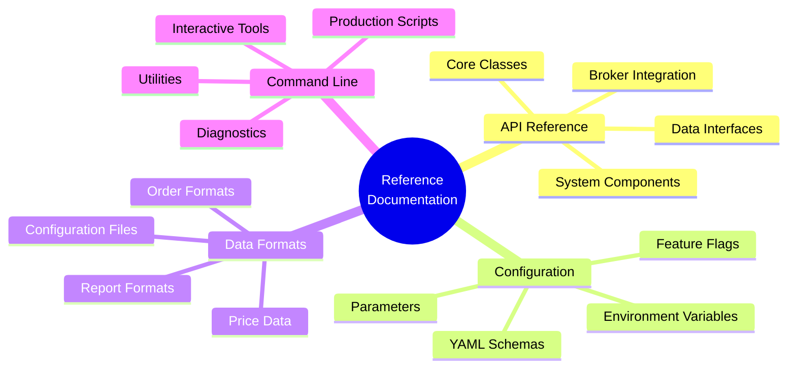
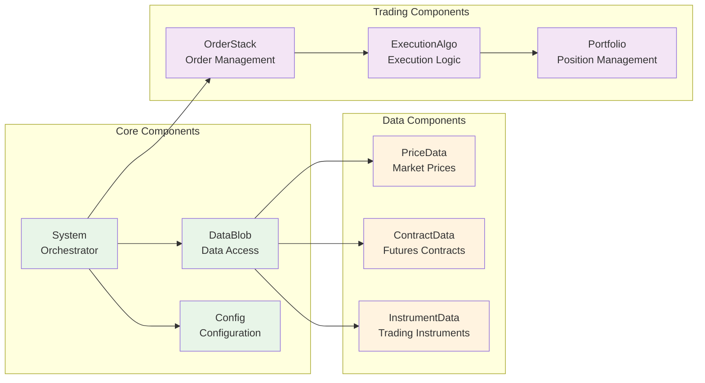

# Reference Documentation

Comprehensive reference materials for pysystemtrade development and operations.



## Reference Categories

### **📖 API Reference**
Complete documentation of all classes, methods, and interfaces:
- **[API Reference](api-reference.md)** - Comprehensive API documentation
- **[Core Classes](api/core-classes.md)** - System, Stage, and base classes
- **[Data Interfaces](api/data-interfaces.md)** - Data access and manipulation
- **[Trading Components](api/trading-components.md)** - Order management and execution
- **[Broker APIs](api/broker-apis.md)** - External broker integration interfaces

### **⚙️ Configuration Reference**
Complete configuration options and parameters:
- **[Configuration Schema](config/configuration-schema.md)** - YAML configuration structure
- **[System Parameters](config/system-parameters.md)** - All configurable system parameters
- **[Environment Variables](config/environment-variables.md)** - Environment configuration options
- **[Feature Flags](config/feature-flags.md)** - Available feature toggles
- **[Default Values](config/default-values.md)** - Complete list of default configurations

### **📊 Data Format Reference**
Specifications for all data formats and schemas:
- **[Price Data Formats](data-formats/price-data.md)** - Price data structure and requirements
- **[Order Data Formats](data-formats/order-data.md)** - Order and execution data formats
- **[Configuration Files](data-formats/config-files.md)** - YAML configuration file formats
- **[Report Formats](data-formats/report-formats.md)** - Generated report structures
- **[Database Schemas](data-formats/database-schemas.md)** - MongoDB collection schemas

### **🖥️ Command Line Reference**
Complete reference for all command-line tools and scripts:
- **[Production Scripts](cli/production-scripts.md)** - All production automation scripts
- **[Interactive Tools](cli/interactive-tools.md)** - Interactive management utilities
- **[Diagnostic Tools](cli/diagnostic-tools.md)** - System diagnostic and debugging tools
- **[Utility Scripts](cli/utility-scripts.md)** - Data management and maintenance utilities
- **[Script Parameters](cli/script-parameters.md)** - Command-line parameter reference

### **🔧 Development Reference**
Development tools and utilities reference:
- **[Testing Framework](dev/testing-framework.md)** - Testing tools and patterns
- **[Debugging Tools](dev/debugging-tools.md)** - Debugging utilities and techniques
- **[Code Generators](dev/code-generators.md)** - Code generation utilities
- **[Extension Points](dev/extension-points.md)** - Framework extension interfaces
- **[Development Tools](dev/development-tools.md)** - Development workflow tools

## Quick Reference Cards

### **System Components Quick Reference**


### **Configuration Quick Reference**
```yaml
# Essential Configuration Parameters
percentage_vol_target: 25        # Volatility targeting (%)
notional_trading_capital: 1000000  # Trading capital ($)
base_currency: "USD"            # Base currency

# Risk Management
max_vs_average_forecast: 2.0    # Maximum forecast vs average
forecast_cap: 20.0              # Forecast cap level
use_forecast_scale_estimates: True

# Data Sources
csv_data_paths:
  csvFuturesInstrumentData: "data/futures/"
  csvFuturesAdjustedPricesData: "data/adjusted_prices/"

# Broker Configuration
ib_ipaddress: "127.0.0.1"      # IB Gateway IP
ib_port: 7497                   # IB Gateway Port
ib_idoffset: 1000              # Order ID offset
```

### **Common Commands Quick Reference**
```bash
# Production Operations
python sysproduction/linux/scripts/run_systems.py        # Run trading systems
python sysproduction/linux/scripts/run_stack_handler.py  # Process orders
python sysproduction/linux/scripts/run_reports.py        # Generate reports

# Interactive Tools
python sysproduction/interactive_order_stack.py          # Manage orders
python sysproduction/interactive_diagnostics.py          # System diagnostics
python sysproduction/interactive_controls.py             # System controls

# Data Management
python sysproduction/linux/scripts/update_sampled_contracts.py  # Update contracts
python sysproduction/linux/scripts/update_historical_prices.py  # Update prices
python sysproduction/linux/scripts/backup_arctic_to_csv.py      # Backup data
```

### **Error Codes Reference**
| Code | Category | Description | Action |
|------|----------|-------------|--------|
| `ERR_001` | Data | Missing price data | Check data sources |
| `ERR_002` | Order | Order rejected by broker | Review order parameters |
| `ERR_003` | System | Configuration error | Validate configuration |
| `ERR_004` | Network | Connection timeout | Check network connectivity |
| `ERR_005` | Risk | Position limit exceeded | Review risk parameters |

## Usage Patterns Reference

### **Common System Creation Patterns**
```python
# Simple CSV-based system
from systems.provided.example.simplesystem import simplesystem
system = simplesystem()

# Custom configuration system
from systems.basesystem import System
from sysdata.sim.csv_futures_sim_data import csvFuturesSimData
from sysdata.config.configdata import Config

data = csvFuturesSimData()
config = Config("path/to/config.yaml")
system = System([stage1, stage2, stage3], data, config)

# Production system
from sysproduction.data.get_data import dataBlob
from systems.provided.futures_chapter15.basesystem import futures_system

data = dataBlob(log_name="production_system")
system = futures_system(data=data)
```

### **Common Data Access Patterns**
```python
# Price data access
prices = data.db_futures_adjusted_prices.get_adjusted_prices("SOFR")
raw_prices = data.db_futures_contract_price.get_prices_for_contract_object(contract)

# Order data access
order_stack = data.db_order_stack.get_order_stack()
trades = data.db_capital.get_series_of_trade_capital()

# Configuration access
config_value = system.config.percentage_vol_target
instrument_weights = system.config.instrument_weights
```

### **Common Production Patterns**
```python
# Production data blob creation
from sysproduction.data.get_data import dataBlob
data = dataBlob(log_name="my_process")

# Process control
from sysproduction.data.control_process import controlProcess
control = controlProcess(data)
control.check_if_okay_to_start_process("my_process")

# Report generation
from sysproduction.reporting.reporting_functions import run_report
report = run_report("daily_pandl_report", data)
```

## Navigation

- **[← Back to Main Documentation](../README.md)**
- **[API Reference →](api-reference.md)**
- **[Configuration Schema →](config/configuration-schema.md)**
- **[Examples →](../examples/README.md)**

---

*This reference documentation provides quick access to all technical specifications and usage patterns for pysystemtrade.*