# Tutorials

Step-by-step tutorials for learning and implementing pysystemtrade systematically.

```mermaid
graph TD
    subgraph "Tutorial Learning Path"
        subgraph "Foundation Level"
            T1[📚 Systematic Trading<br/>Fundamentals]
            T2[🛠️ Environment<br/>Setup] 
            T3[🎯 First Trading<br/>Strategy]
        end
        
        subgraph "Intermediate Level"
            T4[📊 Backtesting &<br/>Analysis]
            T5[🛡️ Risk Management<br/>Implementation]
            T6[🏗️ System Architecture<br/>Deep Dive]
        end
        
        subgraph "Advanced Level"
            T7[🔄 Data Pipeline<br/>Design]
            T8[📈 Multi-Strategy<br/>Systems]
            T9[⚡ Performance<br/>Optimization]
        end
        
        subgraph "Expert Level"
            T10[🏭 Production<br/>Deployment]
            T11[📡 Live Data<br/>Integration]
            T12[🎛️ Order Management<br/>Systems]
            T13[📊 Monitoring &<br/>Maintenance]
            T14[📏 Scaling &<br/>Growth]
        end
    end
    
    T1 --> T2 --> T3
    T3 --> T4 --> T5 --> T6
    T6 --> T7 --> T8 --> T9
    T9 --> T10 --> T11 --> T12 --> T13 --> T14
    
    classDef foundation fill:#e8f5e8
    classDef intermediate fill:#fff3e0
    classDef advanced fill:#f3e5f5
    classDef expert fill:#e3f2fd
    
    class T1,T2,T3 foundation
    class T4,T5,T6 intermediate
    class T7,T8,T9 advanced
    class T10,T11,T12,T13,T14 expert
```



## Tutorial Structure

Each tutorial follows a proven learning methodology:

### **🎯 Learning Objectives**
- Clear, measurable learning outcomes
- Prerequisites and required knowledge
- Estimated time to completion
- Practical skills you'll develop

### **📋 Tutorial Format**
- **Introduction** - Context and motivation
- **Prerequisites** - Required setup and knowledge
- **Step-by-Step Instructions** - Detailed, actionable steps
- **Code Examples** - Complete, runnable examples
- **Exercises** - Hands-on practice opportunities
- **Troubleshooting** - Common issues and solutions
- **Next Steps** - How to continue your learning

## Tutorial Series

### **🌱 Foundation Series (Beginner)**

#### **[Tutorial 1: Understanding Systematic Trading](01-understanding-systematic-trading.md)**
*Duration: 45 minutes | Level: Beginner*

Learn the fundamental concepts behind systematic trading and how pysystemtrade implements these principles.

```mermaid
flowchart LR
    Manual[👤 Manual Trading<br/>Discretionary Decisions] 
    Systematic[🤖 Systematic Trading<br/>Rule-Based Approach]
    
    subgraph "Systematic Components"
        Data[📊 Market Data]
        Rules[📋 Trading Rules]
        Risk[🛡️ Risk Management] 
        Execution[⚡ Execution]
    end
    
    Manual -.-> Systematic
    Data --> Rules --> Risk --> Execution
    
    classDef manual fill:#ffe6e6
    classDef systematic fill:#e6f3ff
    
    class Manual manual
    class Systematic,Data,Rules,Risk,Execution systematic
```



**What You'll Learn:**
- Systematic vs. discretionary trading approaches
- Key components of a systematic trading system
- Risk management and position sizing principles
- The role of backtesting in strategy development

#### **[Tutorial 2: Environment Setup](02-environment-setup.md)**
*Duration: 30 minutes | Level: Beginner*

Complete development environment setup with all required dependencies and tools.

**What You'll Learn:**
- Python environment setup and virtual environments
- Installing pysystemtrade and dependencies
- Configuring development tools (IDE, debugging, testing)
- Setting up data directories and initial configuration

#### **[Tutorial 3: Your First Trading Strategy](03-first-strategy.md)**
*Duration: 60 minutes | Level: Beginner*

Build and test your first complete trading strategy using pysystemtrade.

**What You'll Learn:**
- Creating a simple momentum strategy
- Understanding the System class and stages
- Running your first backtest
- Interpreting basic performance results

### **🔧 Intermediate Series**

#### **[Tutorial 4: Backtesting & Analysis](04-backtesting-analysis.md)**
*Duration: 90 minutes | Level: Intermediate*

Deep dive into backtesting methodology and performance analysis.

**What You'll Learn:**
- Advanced backtesting techniques
- Performance metrics and interpretation
- Comparing multiple strategies
- Statistical significance testing

#### **[Tutorial 5: Risk Management Implementation](05-risk-management.md)**
*Duration: 75 minutes | Level: Intermediate*

Implement comprehensive risk management in your trading systems.

**What You'll Learn:**
- Volatility targeting and position sizing
- Portfolio-level risk controls
- Correlation and diversification analysis
- Dynamic risk adjustment techniques

#### **[Tutorial 6: System Architecture Deep Dive](06-system-architecture.md)**
*Duration: 120 minutes | Level: Intermediate*

Understand the complete pysystemtrade architecture and design patterns.

**What You'll Learn:**
- Stage-based processing architecture
- Data abstraction and the dataBlob pattern
- Configuration management and flexibility
- Extending the framework with custom components

### **🚀 Advanced Series**

#### **[Tutorial 7: Data Pipeline Design](07-data-pipeline.md)**
*Duration: 105 minutes | Level: Advanced*

Design and implement robust data pipelines for production trading.

**What You'll Learn:**
- Multiple data source integration
- Data quality assurance and validation
- Real-time vs. batch processing patterns
- Data backup and recovery strategies

#### **[Tutorial 8: Multi-Strategy Systems](08-multi-strategy.md)**
*Duration: 120 minutes | Level: Advanced*

Build sophisticated multi-strategy trading systems with portfolio optimization.

**What You'll Learn:**
- Strategy allocation and rebalancing
- Cross-strategy risk management
- Performance attribution analysis
- Dynamic strategy weighting

#### **[Tutorial 9: Performance Optimization](09-performance-optimization.md)**
*Duration: 90 minutes | Level: Advanced*

Optimize your systems for maximum performance and scalability.

**What You'll Learn:**
- Profiling and bottleneck identification
- Memory optimization techniques
- Parallel processing implementation
- Caching strategies and data optimization

### **🏭 Expert Series (Production)**

#### **[Tutorial 10: Production Deployment](10-production-deployment.md)**
*Duration: 180 minutes | Level: Expert*

Deploy your trading system to a production environment.

**What You'll Learn:**
- Production environment architecture
- Infrastructure setup and configuration
- Security implementation and best practices
- Deployment automation and CI/CD

#### **[Tutorial 11: Live Data Integration](11-live-data.md)**
*Duration: 150 minutes | Level: Expert*

Integrate real-time market data feeds and broker connections.

**What You'll Learn:**
- Interactive Brokers integration setup
- Real-time data processing and validation
- Market data quality assurance
- Connection management and error handling

#### **[Tutorial 12: Order Management Systems](12-order-management.md)**
*Duration: 135 minutes | Level: Expert*

Implement sophisticated order management and execution systems.

**What You'll Learn:**
- Three-tier order management architecture
- Execution algorithm implementation
- Order routing and broker integration
- Trade reporting and reconciliation

#### **[Tutorial 13: Monitoring & Maintenance](13-monitoring-maintenance.md)**
*Duration: 120 minutes | Level: Expert*

Set up comprehensive monitoring and maintenance procedures.

**What You'll Learn:**
- System health monitoring implementation
- Alert configuration and escalation procedures
- Automated reporting and dashboard creation
- Maintenance procedures and troubleshooting

#### **[Tutorial 14: Scaling & Growth](14-scaling-growth.md)**
*Duration: 165 minutes | Level: Expert*

Scale your systems to handle increased complexity and volume.

**What You'll Learn:**
- Horizontal and vertical scaling strategies
- Load balancing and distribution techniques
- Database optimization and sharding
- Microservices architecture implementation

## Hands-On Exercises

### **Exercise Categories**


### **Progressive Difficulty**
- **Basic Exercises** - Implement simple concepts with guided instructions
- **Intermediate Challenges** - Solve realistic problems with partial guidance
- **Advanced Projects** - Complete end-to-end implementations
- **Expert Scenarios** - Handle complex production situations

## Tutorial Tools & Resources

### **Development Environment**
```bash
# Tutorial-specific virtual environment
python -m venv tutorial-env
source tutorial-env/bin/activate  # Linux/Mac
tutorial-env\Scripts\activate     # Windows

# Install tutorial requirements
pip install -r fork_extensions/tutorials/requirements.txt
```

### **Tutorial Data Sets**
- **Sample Data** - Clean, representative market data for learning
- **Synthetic Data** - Generated data for specific learning scenarios
- **Historical Data** - Real market data for realistic testing
- **Live Simulation** - Paper trading environments

### **Verification Tools**
- **Automated Tests** - Verify your implementations match expected results
- **Performance Benchmarks** - Compare your results with reference implementations
- **Code Quality Checks** - Ensure code follows best practices
- **Portfolio Validation** - Verify trading logic and risk management

## Getting Started

### **Choose Your Path**

1. **Complete Beginner**: Start with Tutorial 1 and progress sequentially
2. **Some Python Experience**: Begin with Tutorial 2 (Environment Setup)
3. **Trading Background**: Jump to Tutorial 3 (First Trading Strategy)
4. **Experienced Developer**: Start with Tutorial 6 (System Architecture)

### **Prerequisites by Level**

#### **Foundation Tutorials (1-3)**
- Basic Python programming knowledge
- Understanding of basic financial concepts
- Familiarity with command-line interfaces

#### **Intermediate Tutorials (4-6)**
- Comfortable with Python data analysis (pandas, numpy)
- Basic statistics and probability concepts
- Understanding of financial markets

#### **Advanced Tutorials (7-9)**
- Solid Python development experience
- Database and data pipeline concepts
- Performance optimization awareness

#### **Expert Tutorials (10-14)**
- Production system deployment experience
- Infrastructure and operations knowledge
- Enterprise software development background

## Navigation

- **[← Back to Main Documentation](../README.md)**
- **[Examples →](../examples/README.md)**
- **[Production Documentation →](../production/README.md)**

---

*These tutorials provide a structured learning path from basic concepts to advanced production implementation of systematic trading systems with pysystemtrade.*